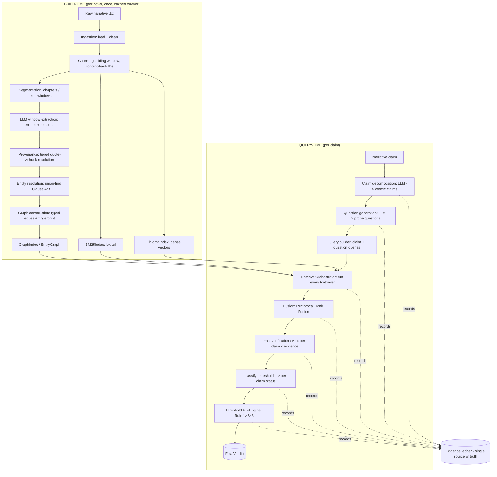
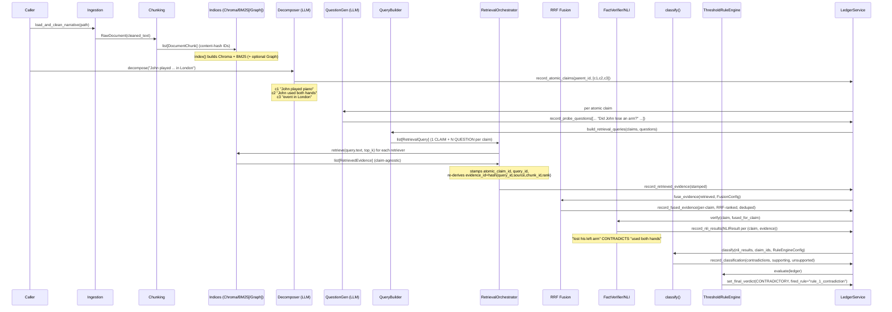

# LNCVS — Master Technical Reference

## Part 1 of 4 — Project Overview, Architecture, Data Flow, and Data Contracts

> **Document scope.** This is the complete engineering knowledge base of the
> Long Narrative Consistency Verification System (LNCVS). It is reverse-engineered
> directly from the repository source, tests, scripts, result artifacts, and the
> two governing specification documents (`Project_spec.md`, `CLAUDE.md`). It is
> intended to let a reader understand the entire system without reading the source.
> Where a fact cannot be verified from the repository it is explicitly flagged as
> such. Nothing here is invented.
>
> The reference is split across four files:
> - **Part 1 (this file):** vision, the spec/CLAUDE divergence, final architecture, dependency rules, repository layout, the end-to-end data flow, and every shared data contract in `schemas/`.
> - **Part 2:** subsystem-by-subsystem reference for the linear pipeline — ingestion, chunking, indexing, the LLM abstraction, retrieval, fusion, reasoning (decomposition, question generation, NLI, fact verification), the ledger, and the rule engine.
> - **Part 3:** the graph subsystem (segmentation, LLM extraction, provenance, entity resolution, construction, retrieval/traversal), LangGraph orchestration, the evaluation framework, and the CLI gap.
> - **Part 4:** project evolution (Phase 0→8 and the H-phase / ER saga), every major engineering decision with its reasoning, the core algorithms, the experimental/diagnostic journey with measured numbers, prompt engineering, configuration reference, and the catalogue of important classes.

---

## 1. What the system is

LNCVS verifies whether a **narrative claim** is consistent with a **long source
narrative** (50,000–100,000+ words). It is a **consistency verification system,
not a question-answering system.**

- **Input:** `(source narrative, narrative claim)`.
- **Output:** a deterministic verdict, plus supporting evidence, contradicting
  evidence, an evidence trace, and a reasoning summary — all carried in a single
  typed `EvidenceLedger`.

The central research hypothesis (`Project_spec.md` §4) is that **graph retrieval +
semantic retrieval + lexical retrieval + explicit evidence tracking** outperforms
standard single-pass RAG for long-context consistency verification, because the
dominant failure modes of large-context LLMs (the "long context fallacy,"
attention dilution, implicit memory, constraint loss, plausibility bias, and
retrieval failure — `Project_spec.md` §2) are not solved by larger context windows.

### What it is *not*
- Not a general-purpose RAG/QA assistant.
- Not a system that answers open-ended questions about a document.
- **Not a system where an LLM produces the final decision.** The verdict is
  produced by deterministic Python (the rule engine), never by a model. This is
  the single most load-bearing architectural invariant in the project.

### The three verdicts

| Verdict | Meaning |
|---|---|
| `CONSISTENT` | Every atomic claim is entailed by retrieved evidence (strict policy) **or** no atomic claim is contradicted (lenient policy — see Part 2 §Rule Engine). |
| `CONTRADICTORY` | At least one atomic claim is contradicted by retrieved evidence. |
| `INSUFFICIENT_EVIDENCE` | At least one atomic claim has neither entailing nor contradicting evidence. This is an explicit admission of a retrieval/coverage gap — **not** a contradiction. |

Verdicts must be **deterministic and reproducible**: the same `(narrative, claim)`
pair under the same configuration must always yield the same verdict. Determinism
is treated as a requirement enforced by construction (pinned seeds/temperatures,
content-hash IDs, input-hash caching), not as an aspiration.

---

## 2. The two governing documents and their divergence

Two specification documents govern the repository, and they **disagree on a
fundamental point**. Per `CLAUDE.md`'s own instruction, divergences must be
flagged rather than silently resolved; this reference flags the divergence
explicitly because it explains the entire shape of the codebase.

| Topic | `Project_spec.md` (v4.0, "Hybrid GraphRAG Architecture") | `CLAUDE.md` (the "how we build" doc) |
|---|---|---|
| **Number of verdicts** | **Two** (`CONSISTENT`, `CONTRADICTORY`) — `Project_spec.md` §3 | **Three** (adds `INSUFFICIENT_EVIDENCE`) |
| **Knowledge Graph** | **In Version 1** — Entity Extraction, KG Construction, Graph Retrieval are all listed as required (`Project_spec.md` §5) | **Version 2 only** — explicitly forbidden in V1 ("no `graph/` module, no `extraction/` module, even 'for later'") |
| **Rule engine** | Deterministic Python, never an LLM (§7.14) | Deterministic Python, never an LLM (identical) |

**How the repository actually resolved it.** The code follows a *blend*:

1. The **three-verdict model won** — `VerdictEnum` has all three values, and the
   `INSUFFICIENT_EVIDENCE` path is tested as a first-class outcome. This is the
   richer, safer model (it refuses to mislabel a coverage gap as a contradiction),
   and `CLAUDE.md` says the spec wins on *what* to build but `CLAUDE.md` governs
   *how*; the three-verdict model is implemented everywhere.
2. The **Knowledge Graph was eventually built** — `graph/` exists and is a full
   subsystem (Phase 8 / "G2"). The way this was reconciled with `CLAUDE.md`'s V1
   prohibition is recorded in `schemas/enums.py`: the V2 entry gate was declared
   satisfied and graph work was *explicitly authorized* to land in the same
   repository. The graph is **opt-in**: no V1 code path constructs or wires
   `GraphRetriever` by default; only the evaluation script `evaluate_with_graph.py`
   does.

This blended history is why the codebase contains both a clean, graph-free linear
pipeline (the "vertical slice") *and* a bolt-on graph retrieval source that is
wired only in an evaluation harness.

---

## 3. Development philosophy (the rules the code obeys)

From `CLAUDE.md`, these are the non-negotiable construction principles. They recur
constantly in the code and explain most of its structure:

1. **Vertical slice before breadth.** A correct end-to-end path (ingestion →
   retrieval → NLI → verdict) had to work before any second retrieval mechanism
   or representation was added.
2. **Determinism by construction.** Any non-deterministic component (LLM calls,
   embedding models) is made deterministic by pinning seeds/temperature and
   caching outputs by input hash.
3. **The rule engine, never an LLM, produces the verdict.** Non-negotiable.
4. **Explainability over cleverness.** Every verdict must trace to specific
   evidence chunks via the ledger. A design that makes the trace harder to audit
   loses to the less clever alternative.
5. **Maintainability over cleverness.**
6. **Typed boundaries.** No `dict` or `List[Any]` ever crosses a module boundary;
   closed vocabularies are enums, not strings.
7. **Never silently fail.** A swallowed exception and a config field that is read
   nowhere are treated as equally forbidden.

### Dependency rules (strictly enforced, and visible throughout)

- `schemas/` is the **universal leaf**: it depends on nothing in `lncvs` and
  everything may depend on it. It is the only place shared data contracts live.
- `llm/` is a **second narrow leaf** (standard library only): the
  provider-agnostic `LLMClient`/`StructuredLLMClient` protocols, `LLMConfig`,
  and caching decorators.
- **Dependencies point downward only:**
  `ingestion/chunking/indexing → retrieval → fusion → reasoning → ledger → rules → orchestration → evaluation`.
  Nothing upstream may import anything downstream.
- No module imports another module's *internals*; cross-module communication is
  only through `schemas/` types and exposed service interfaces.
- Third-party SDKs are each **confined to exactly one file**: `chromadb` →
  `indexing/chroma_index.py`; `rank_bm25` → `indexing/bm25_index.py`;
  `sentence_transformers.CrossEncoder` → `reasoning/nli/model.py`;
  `networkx` → `graph/builder.py`; `openai` → `llm/openai_structured_client.py`;
  `google-genai` → `llm/gemini_*_client.py`; `tiktoken` → `graph/segmentation.py`.
  This is the "source isolation discipline" referenced everywhere in docstrings.

---

## 4. Final system architecture

The system has **two distinct construction-time pipelines** and **one
retrieval-time pipeline**, all converging on the single `EvidenceLedger`.

### 4.1 The three pipelines



### 4.2 The original vs. final architecture (a key distinction)

- **Original / canonical pipeline** (the linear vertical slice, what the LangGraph
  orchestrator actually runs): ingestion → chunking → **semantic + BM25** retrieval
  → RRF fusion → **cross-encoder NLI** → rule engine. **No graph.** This is
  `lncvs.orchestration.graph.LangGraphPipeline` and its equivalence oracle
  `lncvs.evaluation.runner.PipelineRunner`.
- **Final / experimental pipeline** (what the graph-impact and metric-improvement
  studies actually run): the same linear pipeline **plus a third `GraphRetriever`
  source** wired in, **plus an LLM-backed fact verifier** (`LLMFactVerifier`)
  swapped in for the cross-encoder. This wiring lives **only in the evaluation
  script** `scripts/evaluate_with_graph.py`, never in `orchestration/`. The graph
  retriever was never promoted into the LangGraph node path — that promotion is a
  disclosed, deferred production extension.

This split is the most important thing to understand about the system's current
state: **production orchestration (LangGraph) is graph-free and cross-encoder-based;
the research/evaluation path is graph-augmented and LLM-verifier-based.**

---

## 5. Repository structure

```
lncvs/  (under src/)
├── schemas/        # ALL shared Pydantic models + enums — universal leaf
├── llm/            # LLMClient + StructuredLLMClient protocols, configs, caches, Gemini/OpenAI clients
├── ingestion/      # raw load + offset-preserving cleaning
├── chunking/       # sliding-window chunking, content-hash IDs, span-overlap helpers
├── indexing/       # Embedder, ChromaIndex, BM25Index, tokenizer, caches, Indexer protocol
├── retrieval/      # Retriever protocol, Semantic/BM25 retrievers, orchestrator, query builder, identity
├── fusion/         # Reciprocal Rank Fusion + config (fingerprinted)
├── reasoning/
│   ├── decomposition/      # claim -> atomic claims (LLM)
│   ├── questions/          # atomic claim -> probe questions (LLM)
│   ├── nli/                # cross-encoder NLI model + verifier + cache
│   └── fact_verification/  # FactVerifier protocol, CrossEncoder + LLM verifiers, NLIResult adapter
├── ledger/         # EvidenceLedger mutation API (LedgerService)
├── rules/          # RuleEngine ABC, pure classify(), ThresholdRuleEngine
├── orchestration/  # LangGraph StateGraph, nodes, reducers, channels, resources, fusion baseline
├── evaluation/     # PipelineRunner, EvaluationHarness, metrics, reporting, dataset, fingerprint
├── graph/          # (Phase 8 / "G2", opt-in) segmentation, llm_extraction, provenance,
│                   #   entity_resolution, construction, builder/index/traversal/retriever
├── cli/            # NOT IMPLEMENTED (empty package, documented gap)
└── configs/        # NOT IMPLEMENTED (empty package)
```

Per `CLAUDE.md`, every module is expected to have `__init__.py`, `config.py`,
`models.py` (re-exporting from `schemas/`, never defining competing types),
`service.py`, and `tests/`. This is followed closely (with pure helper modules
like `identity.py`, `parser.py`, `prompts.py` added where the work is a pure
function rather than a stateful service).

Top-level non-package directories: `scripts/` (evaluation drivers, audits,
prototypes, diagnostics — see Part 4), `tests/` (114 test files), `data/` (the two
real novels + train/test CSVs + small synthetic narratives), `datasets/` (gold
JSONL), `results/` (caches + run artifacts), `docs/` (the problem statement PDF).

### Dependencies (from `pyproject.toml`)

`pydantic>=2.0`, `sentence-transformers>=2.2`, `chromadb>=0.4`, `rank-bm25>=0.2`,
`numpy>=1.24`, `matplotlib>=3.7`, `langgraph>=1.2,<2.0`, `networkx>=3.0`,
`tiktoken>=0.7`, `openai>=1.0`, `google-genai>=1.0`, `python-dotenv>=1.0`.
Dev: `pytest`, `black` (line-length 100), `ruff`, `mypy` (strict).
Tests run with `-m "not slow"` by default; `pythonpath = ["src", "scripts"]` so
tests can import the evaluation-script wiring functions directly.

---

## 6. End-to-end data flow: tracing one claim

This traces the §14 dummy case — narrative "John lost his left arm in an accident
in 2010. John moved to London in 2012." with claim "John played a complex
two-handed piano piece at a pub in London." — through every object and
transformation. Expected verdict: **CONTRADICTORY**.



**Objects created, in order:**

1. `RawDocument(source_id, raw_text, cleaned_text)` — ingestion output; offsets are
   relative to `cleaned_text`.
2. `list[DocumentChunk]` — each `chunk_id = sha256(source_id:start:end:text)[:16]`,
   frozen, carries `char_start/char_end/chapter/source_id`.
3. Indices — `ChromaIndex`, `BM25Index`, optionally `GraphIndex`. These store/own
   the chunk *bodies*; the ledger will store only chunk *IDs*.
4. `list[AtomicClaim]` — from the decomposer; `claim_id =
   sha256(parent_claim_id:index:text)[:16]`, `parent_claim_id =
   sha256("source:"+original_claim)[:16]`.
5. `list[ProbeQuestion]` — additive; may be empty (legitimately).
6. `list[RetrievalQuery]` — one `CLAIM`-origin query per atomic claim (always),
   plus one `QUESTION`-origin query per probe question. `query_id =
   sha256(atomic_claim_id:origin:question_id:text)[:16]`.
7. `list[RetrievedEvidence]` — per (query × retriever); stamped with
   `atomic_claim_id`/`query_id` and a collision-free re-derived `evidence_id` by
   the orchestrator.
8. `list[FusedEvidence]` — per `(atomic_claim_id, chunk_id)`, deduped, RRF-scored.
9. `list[NLIResult]` (or `FactVerification` → `NLIResult` via the compat adapter)
   — per `(claim, fused evidence)`; the contradiction on c2 is detected here.
10. `ClassificationOutcome` — per-claim `ClaimStatus` map + `Contradiction` /
    `SupportingEvidence` / `unsupported_claim_ids` records.
11. `FinalVerdict(verdict=CONTRADICTORY, fired_rule="rule_1_contradiction", ...)`.

Every step above is recorded into the **single `EvidenceLedger`** through
`LedgerService`, each write appending a `LedgerEvent` to the append-only audit log.

**Caches encountered:** `CachingEmbedder` (embedding vectors), `CachingLLMClient` /
`CachingStructuredLLMClient` (decomposition, question gen, extraction, LLM
verification — file-backed JSONL), `CachingNLIModel` (cross-encoder predictions).
Every cache key is namespaced by a config `fingerprint()` so a config change can
never serve a stale result computed under a different configuration.

**Protocols crossed:** `Embedder`, `Indexer`, `Retriever`, `LLMClient`,
`StructuredLLMClient`, `NLIModel`, `FactVerifier`, `RuleEngine`, `LedgerProducer`.
Each is a dependency-injection seam with at least one real and one fake/test
implementation.

---

## 7. Data contracts — the `schemas/` module

`schemas/` is the universal leaf. Every field is a typed model; **no field
anywhere accepts a raw `dict` or `List[Any]`** (a direct, tested consequence of
the explainability requirement — an untyped ledger cannot be audited). Almost all
models are `frozen=True` (immutable).

### 7.1 Enums (closed vocabularies) — `schemas/enums.py`

| Enum | Values | Notes |
|---|---|---|
| `VerdictEnum` | `CONSISTENT`, `CONTRADICTORY`, `INSUFFICIENT_EVIDENCE` | The only verdicts the rule engine may emit. |
| `NLILabel` | `ENTAILMENT`, `CONTRADICTION`, `NEUTRAL` | One per (premise, hypothesis) pair. |
| `FactVerificationLabel` | `SUPPORTED`, `CONTRADICTED`, `NOT_MENTIONED` | Fact-verification vocabulary, conceptually prior to NLI; mapped one-directionally to `NLILabel` (`SUPPORTED→ENTAILMENT`, `CONTRADICTED→CONTRADICTION`, `NOT_MENTIONED→NEUTRAL`). |
| `RetrievalSource` | `SEMANTIC`, `LEXICAL`, `GRAPH` | `GRAPH` is the one documented exception to "no graph refs in V1 code"; produced only by `GraphRetriever`. |
| `QueryOrigin` | `CLAIM`, `QUESTION` | `CLAIM` queries always exist (fallback when no probe questions); `QUESTION` queries are additive. |
| `FusionStrategy` | `RRF`, `ROUND_ROBIN` | `RRF` is the only production strategy; `ROUND_ROBIN` is an evaluation-only ablation baseline. Lives in `schemas/` (not `evaluation/`) so `orchestration/` can read it without importing `evaluation/`. |
| `PipelineStage` | `INGESTION`, `CHUNKING`, `INDEXING`, `CLAIM_DECOMPOSITION`, `QUESTION_GENERATION`, `RETRIEVAL`, `FUSION`, `NLI_VERIFICATION`, `RULE_ENGINE`, `COMPLETE`, `ERROR` | Used by `ControlState`, `LedgerEvent`, `ReasoningStep`. `ERROR` is a terminal failure-routing stage. |

Graph enums (`schemas/graph.py`): `EntityType` (`PERSON`, `LOCATION`,
`ORGANIZATION`, `OBJECT`, `OTHER`), `RelationType` (`CO_OCCURS`, `FAMILY_OF`,
`ALLY_OF`, `ENEMY_OF`, `MEMBER_OF`, `LOCATED_AT`, `POSSESSES`, `SAME_AS`),
`ParticipantRole` (`AGENT`, `PATIENT`, `EXPERIENCER`, `LOCATION`, `INSTRUMENT`),
`TemporalKind` (`ABSOLUTE`, `RELATIVE`, `NONE`). `CO_OCCURS` is produced only by
the G1 deterministic builder; the typed relations only by the G2 LLM extractor.

### 7.2 Core content models

| Model | Key fields | Immutability & invariants |
|---|---|---|
| `RawDocument` | `source_id`, `raw_text`, `cleaned_text` | frozen; offsets are relative to `cleaned_text`, not `raw_text`. |
| `DocumentChunk` | `chunk_id`, `text`, `char_start`, `char_end`, `chapter?`, `source_id` | frozen; `char_end > char_start` validated; `chunk_id` is a content hash. |
| `Provenance` | `chunk_id`, `char_start`, `char_end` | frozen; `char_end > char_start`. The universal "where did this come from" pointer. |
| `AtomicClaim` | `claim_id`, `text`, `parent_claim_id?`, `index` | frozen; content-hash ID. |
| `ProbeQuestion` | `question_id`, `atomic_claim_id`, `text`, `index` | frozen; content-hash ID. |
| `RetrievalQuery` | `query_id`, `text`, `atomic_claim_id`, `question_id?`, `origin` | frozen; validator enforces `question_id is None ⇔ origin==CLAIM`. |
| `RetrievedEvidence` | `evidence_id`, `chunk_id`, `text`, `source`, `raw_score`, `rank`, `provenance`, `atomic_claim_id?`, `query_id?` | frozen; `rank≥1`. `atomic_claim_id`/`query_id` are Optional at construction (retrievers are claim-agnostic) and stamped by the orchestrator. |
| `FusedEvidence` | `atomic_claim_id`, `chunk_id`, `text`, `rrf_score`, `contributing_sources`, `contributing_query_ids` | frozen; deliberately minimal — **no `source_ranks`** (per-rank detail stays in `retrieved_evidence`, the single source of truth). |
| `NLIResult` | `atomic_claim_id`, `evidence_chunk_id`, `label`, `score∈[0,1]`, `premise`, `hypothesis` | frozen; **direction pinned**: `premise = evidence text`, `hypothesis = claim text` — stored on every record so direction is auditable. |
| `FactVerification` | `atomic_claim_id`, `evidence_chunk_id`, `label`, `confidence`, `supporting_quotes=()`, `explanation` | frozen; richer audit-first sibling of `NLIResult`; `supporting_quotes` empty is legal for `NOT_MENTIONED`. |
| `SupportingEvidence` | `atomic_claim_id`, `evidence_chunk_id`, `nli_score`, `explanation?` | frozen. |
| `Contradiction` | `atomic_claim_id`, `evidence_chunk_id`, `nli_score`, `explanation?` | frozen. |
| `ReasoningStep` | `stage`, `description`, `timestamp` | frozen; `timestamp` is a wall-clock field (the accepted non-determinism exception). |
| `LedgerEvent` | `event_id`, `stage`, `message`, `timestamp` | frozen; append-only audit entry; `timestamp` non-deterministic by design. |
| `FinalVerdict` | `verdict`, `fired_rule`, `rationale`, `confidence?`, `contradicted_claim_ids`, `unresolved_claim_ids` | frozen; only the rule engine may construct one; `fired_rule` names exactly which rule decided. |

### 7.3 The `EvidenceLedger` — `schemas/ledger.py`

The single source of truth for one verification run. **Not frozen** (it is mutated
through `LedgerService`), but every field is a typed model or list of typed models.

```
EvidenceLedger:
  original_claim: str
  original_claim_id: str | None          # set once by decomposition
  narrative_chunk_ids: list[str]          # IDs only — chunk bodies live in an injected store
  atomic_claims: list[AtomicClaim]
  probe_questions: list[ProbeQuestion]
  retrieval_queries: list[RetrievalQuery]
  retrieved_evidence: list[RetrievedEvidence]   # pre-fusion, claim-linked, the rank source of truth
  fused_evidence: list[FusedEvidence]
  nli_results: list[NLIResult]
  contradictions: list[Contradiction]            # derived explainability co-product
  supporting_evidence: list[SupportingEvidence]  # derived explainability co-product
  unsupported_claims: list[str]                  # claim IDs with no entailing/contradicting evidence
  reasoning_trace: list[ReasoningStep]
  ledger_log: list[LedgerEvent]                  # append-only audit log
  final_verdict: FinalVerdict | None             # set exactly once, by the rule engine
```

Critical design points:
- **The ledger stores chunk IDs, never chunk bodies.** At 100k-word scale, passing
  full chunk text through state is a bottleneck; bodies stay in an injected store
  keyed by ID.
- `contradictions` / `supporting_evidence` / `unsupported_claims` are an
  *explainability co-product* written by `record_classification()`. The rule engine
  **never reads them back** — it recomputes from `nli_results` via the pure
  `classify()` helper, avoiding a circular "engine reads its own output" path.

### 7.4 `GraphState`, `ControlState`, `StageError` — `schemas/state.py`

`GraphState` is **never a flat bag of fields**. It is exactly two members:

```
GraphState:
  ledger:  EvidenceLedger   # domain state — the single source of truth
  control: ControlState     # orchestration-only — NEVER read by the rule engine
```

`ControlState`: `current_stage`, `errors: list[StageError]`, `retry_count`,
`degraded_sources: list[RetrievalSource]`, `config_fingerprint`. The split is
load-bearing: orchestration concerns (retries, errors, current stage) must never
leak into the ledger, and evidence/claims/verdicts must never leak into
`ControlState`.

### 7.5 Graph content models — `schemas/graph.py`

`EntityRecord` (`entity_id`, `canonical_name`, `entity_type`, `provenance` tuple),
`EntityRelation` (`subject_entity_id`, `object_entity_id`, `relation_type`,
`weight`, `provenance`), `EventRecord`, `EventParticipation`. All frozen,
content-hash IDs, append-only. **Direction convention is load-bearing**: `CO_OCCURS`
edges store endpoints in ascending entity-ID order (symmetric); every typed
(LLM-extracted) relation stores `subject→object` exactly as extracted, never
reordered — reordering would silently invert `POSSESSES`/`LOCATED_AT`. (Events are
constructed but never reach retrieval — see Part 3.)

### 7.6 Evaluation models — `schemas/evaluation.py`

`AblationVariant` (`name`, `use_question_generation`, `use_bm25`,
`fusion_strategy`, with `fingerprint()`), `standard_ablation_matrix()` (the four
variants: `full`, `no_question_generation`, `no_bm25`, `no_rrf`), `GoldSpan`
(span-based gold, **not** chunk-id-based — chunk IDs change under re-chunking),
`GoldExample`, `EvaluationDataset`, and the metric models (`RankCutoffMetric`,
`RetrievalMetrics`, `PerClassMetric`, `ConfusionCell/Matrix`, `VerdictMetrics`,
`CitationMetrics`, `StageLatency`, `LatencyMetrics`, `ProvenanceFingerprints`,
`ExampleResult`, `EvaluationReport`, `AblationReport`). `AblationVariant`/
`FusionStrategy`/`standard_ablation_matrix` live in `schemas/` (relocated from
`evaluation/` in Phase 7) so `orchestration/` can read them without importing
`evaluation/`; `evaluation/config.py` re-exports them for backward compatibility.

---

*Continued in Part 2 — the linear-pipeline subsystems (ingestion through the rule
engine), each with purpose, inputs, outputs, internal algorithm, design decisions,
engineering constraints, failure modes, tests, and dependencies.*
