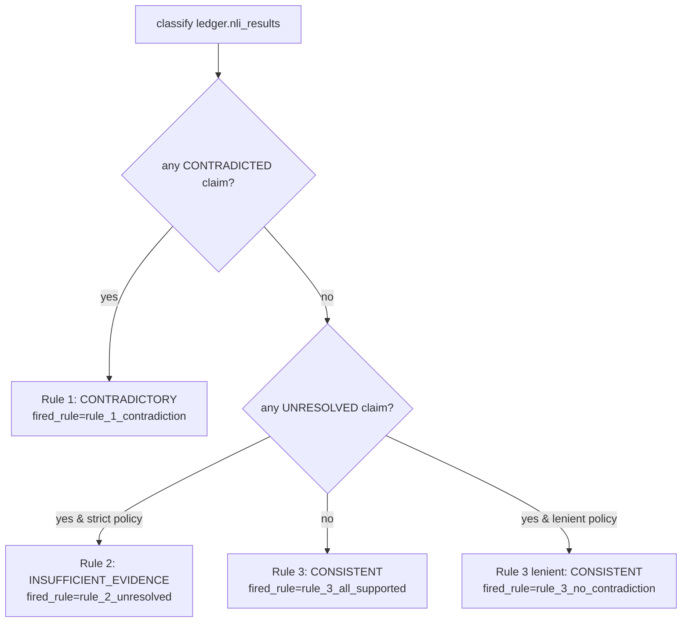

# LNCVS — Master Technical Reference

## Part 2 of 4 — The Linear Pipeline Subsystems

> This part documents every subsystem of the graph-free linear pipeline, in
> dependency order: ingestion → chunking → indexing → the LLM abstraction →
> retrieval → fusion → reasoning (decomposition, questions, NLI, fact
> verification) → ledger → rules. Each subsystem gives Purpose, Inputs, Outputs,
> Internal Workflow, Design Decisions, Engineering Constraints, Failure Modes,
> Tests, and Dependencies.

---

## 8. Ingestion — `lncvs/ingestion/`

**Purpose.** Convert a raw narrative file on disk into a typed, cleaned
`RawDocument` ready for chunking.

**Inputs.** A filesystem `Path` and a `source_id` string.
**Outputs.** `RawDocument(source_id, raw_text, cleaned_text)`.

**Internal workflow.**
- `loader.load_text_file(path)` — reads UTF-8; raises `FileNotFoundError` (with an
  actionable message) if the path is not a file, and `ValueError` if it cannot be
  decoded as UTF-8.
- `cleaning.clean_text(raw)` — pure, deterministic normalization:
  1. strip a leading UTF-8 BOM,
  2. normalize CRLF/CR → LF,
  3. right-strip every line,
  4. collapse 3+ consecutive blank lines to exactly 2 (preserves paragraph breaks
     without unbounded blank runs),
  5. strip leading/trailing whitespace from the whole document.
- `service.load_and_clean_narrative(path, source_id)` composes the two and raises
  `ValueError` if cleaning yields empty content.

**Design decision — no offset map back to raw text.** Cleaning operates on the
whole document and deliberately does **not** preserve a character-offset mapping
back to `raw_text`. `raw_text` is retained for audit/debugging only. Everything
downstream (chunking, provenance, gold spans) works exclusively in `cleaned_text`
coordinates, so internal offset consistency is guaranteed even though raw↔clean
mapping is not.

**Engineering constraints.** Deterministic and dependency-free (regex + string
ops only). **Failure modes:** missing file, non-UTF-8, empty-after-cleaning — all
raise meaningful exceptions, never silent.

**Tests.** `tests/ingestion/` — loader (missing file, bad encoding), cleaning
(each normalization rule), service (empty-content rejection).

---

## 9. Chunking — `lncvs/chunking/`

**Purpose.** Split `cleaned_text` into retrieval-friendly, overlapping chunks with
deterministic content-hash IDs and exact source offsets.

**Inputs.** `RawDocument`, `ChunkingConfig(chunk_size, overlap)`.
**Outputs.** `list[DocumentChunk]`.

**Internal workflow (sliding window).**
```
step = chunk_size - overlap
start = 0
while start < len(text):
    end = min(start + chunk_size, len(text))
    chunk_text = text[start:end]
    emit DocumentChunk(
        chunk_id = sha256(f"{source_id}:{start}:{end}:{chunk_text}")[:16],
        text=chunk_text, char_start=start, char_end=end,
        chapter=None, source_id=source_id)
    if end == len(text): break
    start += step
```

**Config.** `ChunkingConfig` is frozen; a validator enforces `overlap < chunk_size`.
Production runs (the real novels) use **`chunk_size=700, overlap=120`** — derived
empirically in `scripts/validate_long_narrative.py` as the largest chunk size whose
worst-case `(premise, hypothesis)` token count stays comfortably under the
cross-encoder NLI `max_length=256`. (Castaways → 1,424 chunks; Monte Cristo →
4,561 chunks.)

**Span-overlap helpers — `chunking/span_overlap.py`.** Two pure functions
(`chunks_overlapping_span`, `chunks_overlapping_any_span`) that map a character
span to the set of chunk IDs that overlap it. Relocated here from `evaluation/` in
Phase 8/G2 Slice 4 so upstream modules (the graph's provenance assignment) can
share the identical overlap logic without inverting the dependency direction
(`evaluation/` is the bottom of the chain). `evaluation.dataset.map_spans_to_chunks`
is now a thin `GoldSpan` adapter over these primitives.

**Design decisions.**
- **Content-hash IDs, not integers.** Re-chunking identical input reproduces
  identical IDs; the same ID space is shared across Chroma and BM25 indices, so
  fusion can dedup by `chunk_id` with no ID-reconciliation step.
- **Chapter is always `None` in this path** — chapter detection is a graph-side
  concern (see Part 3 segmentation), not implemented for the linear chunker.

**Failure modes.** Empty text, `overlap≥chunk_size` (config validation). **Tests.**
`tests/chunking/` — chunk-ID stability across repeated runs, coverage/reconstruction,
config validation, span-overlap.

---

## 10. Indexing — `lncvs/indexing/`

**Purpose.** Build and query the dense (Chroma) and lexical (BM25) indices over the
shared chunk-ID space, behind a single `Indexer` protocol. Provide the `Embedder`
abstraction and the embedding cache.

### 10.1 Protocols and config
- `Indexer` (protocol): `index(chunks)`, `query(query_text, top_k) -> list[RetrievedEvidence]`.
- `Embedder` (protocol): `embed_texts(list) -> list[vector]`, `embed_query(text) -> vector`.
- `EmbeddingConfig(model_name, device="cpu", normalize_embeddings=True)` with a
  `fingerprint()` over `(model_name, device, normalize_embeddings)`.

### 10.2 `SentenceTransformerEmbedder`
The only real embedder; loads a sentence-transformers model eagerly at
construction. Production model: **`sentence-transformers/all-MiniLM-L6-v2`**,
L2-normalized (required for cosine). `embed_texts([])` raises rather than returning
silently empty.

### 10.3 `CachingEmbedder`
Decorator satisfying `Embedder`. Caches vectors by `(config.fingerprint(), text)`.
Batches: only cache misses are recomputed and stored. The fingerprint namespacing
guarantees a different model/device/normalization can never serve a stale vector.
`InMemoryEmbeddingCache` is the only cache backend (no persistence across process
restarts — a documented limitation).

### 10.4 `ChromaIndex` (the only `chromadb` importer)
- Backed by an **ephemeral, in-memory** Chroma collection (`hnsw:space=cosine`).
  **No persistence** — must be rebuilt each run (documented, deliberate).
- Embeddings are **always computed by the injected `Embedder` and passed
  explicitly**; Chroma's default embedding function is never invoked (no hidden
  model download).
- `query()` returns `RetrievedEvidence(source=SEMANTIC, raw_score=max(0, 1-distance),
  rank=1-indexed, ...)` with a deterministic `evidence_id = sha256(query:chunk_id:rank)[:16]`
  (later re-derived by the orchestrator — see §12).

### 10.5 `BM25Index` (the only `rank_bm25` importer)
- In-memory `BM25Okapi` over the same `DocumentChunk` list → same chunk-ID space as
  Chroma by construction.
- **Shared tokenizer** — `indexing/tokenizer.tokenize()` (lowercase,
  `[a-z0-9]+` token split) is used on **both** corpus and query sides. This is a
  deliberate guard: tokenization divergence between indexing and querying is a
  silent recall killer (a query token tokenized differently than the corpus
  retrieves nothing, with no error). There must never be a second tokenizer.
- Ties (including an all-zero-score query, e.g. no query token in vocabulary) break
  deterministically by ascending `chunk_id`, so ordering never depends on iteration
  order. Source = `LEXICAL`.

**Design decision — RRF over score normalization (motivated here).** BM25 scores
are unbounded; cosine similarity is bounded `[0,1]`. The two are explicitly
incomparable, which is *why* fusion (§13) operates on ranks, not raw scores.

**Failure modes.** Empty chunk list (raise), `top_k<1` (raise), querying an unbuilt
BM25 index (raise). **Tests.** `tests/indexing/` — Indexer contract conformance,
chroma/bm25 query shape, tokenizer, embedding cache hit/miss, embedding-config
fingerprint, **evidence-ID determinism**.

---

## 11. The LLM abstraction — `lncvs/llm/`

**Purpose.** A provider-agnostic boundary for all LLM calls, plus input-hash caching
that makes those calls deterministic. The second narrow leaf module (standard
library only; no vendor SDK in the protocol files).

### 11.1 Two protocols (deliberately separate)
- `LLMClient`: `complete(prompt) -> LLMCompletion(text, model_fingerprint)`. Used by
  **claim decomposition and question generation**.
- `StructuredLLMClient`: `complete_structured(prompt, response_schema) ->
  StructuredCompletion(data: dict, model_fingerprint, response_id)`. Used by
  **graph extraction and the LLM fact verifier**. `data` is the one intentional
  "untyped dict at a generic boundary" — the *caller* must validate it into a typed
  model immediately (the same discipline `parse_decomposition_response` applies to
  `LLMCompletion.text`).

`StructuredLLMClient` was designed provider-agnostic from the start (G2 "Decision 1")
specifically so a second provider could be added without touching the protocol or
any consumer.

### 11.2 `LLMConfig` and the caching philosophy
`LLMConfig(model_name, temperature=0.0, max_tokens=1024)` with `fingerprint()` over
`(model_name, temperature, max_tokens)` **only**. Crucially, the fingerprint does
**not** fold in a prompt-template version — because the cache key already includes
the *full rendered prompt text*. A template edit changes the rendered prompt →
changes the cache key automatically. `prompt_version` fields exist on some configs
purely as **audit provenance**, never as a cache-correctness mechanism.

### 11.3 Caches
- `CachingLLMClient` — keys on `sha256(fingerprint:prompt)`.
- `CachingStructuredLLMClient` — keys on `sha256(fingerprint:schema_version:prompt)`
  (schema_version folded in because the same prompt under two schema versions must
  not collide).
- Backends: `InMemory*` (no persistence) and **`Jsonl*`** (file-backed, one JSON
  line per entry, loaded eagerly at construction, **appended immediately on every
  miss** so a crash mid-run never loses already-paid-for completions). The JSONL
  caches are meant to be committed to version control so the graph/decompositions
  can be rebuilt forever with zero API calls — the "Tier-1 reproducibility
  guarantee."

### 11.4 Real provider clients
- **`GeminiLLMClient`** (plain text, `LLMClient`) and **`GeminiStructuredClient`**
  (`StructuredLLMClient`) — the only `google-genai` importers. Both retry 429/503
  with exponential backoff (5 retries, 5s initial, ×2). Both disable Gemini 2.5
  "thinking" tokens (`thinking_budget=0`) because those tokens are drawn from the
  same `max_output_tokens` budget and silently truncated real completions during
  live runs. `GeminiStructuredClient` includes a **schema-dialect adapter**
  (`_to_gemini_schema`) translating JSON-Schema nullable-unions (`"type":[X,"null"]`)
  into Gemini's OpenAPI-flavored `"type":X,"nullable":true`, and stripping
  `additionalProperties` (unsupported by Gemini) — confined entirely to this file;
  the canonical schema constant is never mutated.
- **`OpenAIStructuredClient`** (`StructuredLLMClient`) — the only `openai` importer.
  Uses Chat Completions `response_format={"type":"json_schema", "strict":True}` for
  provider-enforced structured output. Raises if `finish_reason != "stop"`.

**Design decision — why two providers.** `GeminiStructuredClient` was added when
the OpenAI account had no usable billing quota and Gemini's free tier did; later the
OpenAI client became the working path for the LLM fact verifier when the Gemini key
became unavailable. The provider is selectable via a single constant in the eval
script.

**Failure modes.** No content / truncation (raise with an actionable
"raise max_tokens" message), non-retryable API errors (propagate immediately),
malformed JSON (raise with `finish_reason`). **Tests.** `tests/llm/` — both
clients, both caches, config fingerprint, structured round-trip.

---

## 12. Retrieval — `lncvs/retrieval/`

**Purpose.** Turn atomic claims + probe questions into queries, run them through
every retrieval backend, and stamp claim/query/source provenance onto otherwise
claim-agnostic evidence — the one layer that knows about claims.

### 12.1 The claim-agnostic boundary (a central design rule)
`Retriever` (protocol): `retrieve(query: str, top_k) -> list[RetrievedEvidence]`.
`SemanticRetriever` and `BM25Retriever` are thin wrappers over an injected
`Indexer`; they know nothing about `AtomicClaim`, `ProbeQuestion`, or
`RetrievalQuery`. Therefore `RetrievedEvidence.atomic_claim_id` / `.query_id` are
**Optional at construction** — a bare retriever cannot supply them.

### 12.2 `build_retrieval_queries` (pure)
One `CLAIM`-origin query per atomic claim (always present — the fallback when a
claim has no probe questions) plus one `QUESTION`-origin query per probe question.
Deduplicated by `query_id`. `query_id = sha256(atomic_claim_id:origin:question_id:text)[:16]`
(`question_id=""` for CLAIM queries).

### 12.3 `RetrievalOrchestrator` (the provenance boundary)
Takes a **list** of `Retriever`s (one per source), runs each `RetrievalQuery`
through every retriever in fixed order, and stamps each result via `model_copy`:
- `atomic_claim_id`, `query_id` ← from the query;
- `evidence_id` ← **re-derived** as `make_evidence_id(query_id, source, chunk_id, rank)`.

**Why re-derive `evidence_id`.** A bare retriever's `evidence_id = hash(query_text,
chunk_id, rank)` collides in two ways the orchestrator fixes:
1. Two different atomic claims generating identical query text would collide →
   fixed by folding in `query_id` (which already encodes the claim).
2. Two different sources returning the same chunk at the same rank for the same
   query would collide → fixed by folding in `source` (Phase 4, when BM25 was
   added).
So the final ID is collision-free across claims, queries, **and** sources.

**Linkage invariant.** "Every piece of evidence in the ledger is claim-linked" is
enforced at the **ledger write boundary** (`LedgerService.record_retrieved_evidence`
rejects any record with `None` claim/query IDs or unknown IDs), not at the type
level. A single-retriever list (semantic-only) is a fully supported degenerate
case. A query with zero results is **not an error** — it is the correct input to
`INSUFFICIENT_EVIDENCE`.

**`grouping.group_evidence_by_claim`** — a pure transient view (dict) for NLI prep;
never stored in the ledger (the ledger keeps flat lists, no dicts). Raises if any
record is unstamped.

**Tests.** `tests/retrieval/` — Retriever contract conformance, orchestrator
stamping, query builder, grouping, partial-failure isolation, retrieval config.

---

## 13. Fusion — `lncvs/fusion/`

**Purpose.** Combine per-source, per-query ranked evidence into one deduplicated,
per-claim ranked `FusedEvidence` list via Reciprocal Rank Fusion.

**Inputs.** `list[RetrievedEvidence]` (claim-stamped), `FusionConfig(rrf_k=60,
top_k_fused=10)`.
**Outputs.** `list[FusedEvidence]`.

**Algorithm (`fuse_evidence`).**
1. Validate every record has a non-`None` `atomic_claim_id` (else raise — it never
   passed the orchestrator).
2. Group by `(atomic_claim_id, chunk_id)`.
3. For each group, `rrf_score = Σ 1/(rrf_k + rank)` over every `(query, source)`
   contribution that surfaced that chunk for that claim. Collect distinct
   `contributing_sources` and `contributing_query_ids` (in first-seen order).
4. Per claim, sort best-first by `(-rrf_score, chunk_id)` — **ties break
   deterministically by ascending `chunk_id`** — and cap at `top_k_fused`.

**Why ranks, not scores.** RRF was chosen over score normalization precisely because
raw scores are incomparable across sources (BM25 unbounded vs. cosine `[0,1]`), but
rank position is always comparable. This is the formal justification for the whole
fusion design.

**`FusedEvidence` is deliberately minimal — no `source_ranks`.** Per-rank detail
already lives, undeduplicated, in `EvidenceLedger.retrieved_evidence` (the single
source of truth). Denormalizing a summarized version risks drift, and "one rank per
source" is lossy the moment a claim has more than one query per source (the common
case). To recover a chunk's per-source ranks, join `retrieved_evidence` on
`(atomic_claim_id, chunk_id)`. `FusionConfig.fingerprint()` (over `rrf_k`,
`top_k_fused`) is what makes any `rrf_score` independently recomputable from the
ledger — replacing the audit value `source_ranks` would have offered.

**Isolation.** `fusion/` imports `schemas/` only — never `retrieval/` — so it is a
pure, independently testable transform. (Grouping logic is intentionally
re-implemented rather than imported from `retrieval.grouping`, to keep that
independence real.)

**Tests.** `tests/fusion/` — RRF math against hand-computed values, deterministic
tie-breaking, config fingerprint, empty input.

---

## 14. Reasoning — claim decomposition — `lncvs/reasoning/decomposition/`

**Purpose.** Decompose a complex narrative claim into atomic, self-contained
factual assertions. Reduces retrieval ambiguity.

**Inputs.** `original_claim: str`, an injected `LLMClient`, `DecompositionConfig`.
**Outputs.** `list[AtomicClaim]` (always ≥1).

**Workflow.** `LLMClaimDecomposer.decompose`:
1. `parent_claim_id = sha256("source:"+claim)[:16]`.
2. Render the versioned prompt (below), call `LLMClient.complete`.
3. `parse_decomposition_response` (pure) parses the JSON array.

**Prompt** (`prompts.PROMPT_TEMPLATE`, `PROMPT_VERSION = sha256(template)[:8]`):
instructs "Output ONLY a JSON array of strings"; each string one atomic claim;
resolve all pronouns so each claim stands alone; add nothing not stated/implied;
omit nothing present.

**Parser robustness.** A real-execution finding: ~29% of `gemini-2.5-flash` calls
wrapped the array in a markdown code fence (```` ```json ... ``` ````) despite the
instruction, which strict `json.loads` cannot parse. `_strip_markdown_fence` removes
one optional fence; absent a fence it is a no-op. The parser deduplicates
(case-insensitive), assigns content-hash IDs (`sha256(parent:index:text)[:16]`), and
**raises** on malformed JSON, non-array, non-string element, **zero claims**, or
exceeding `max_atomic_claims` (default 10).

**Design decision — zero atomic claims is a parser error.** A claim must decompose
into *something*; an empty result is a failure, not a vacuous success. (Contrast
question generation, §15, where empty is legal.)

**Config.** `DecompositionConfig(llm_config, prompt_version=PROMPT_VERSION,
max_atomic_claims=10)`. Production decomposition model: `gemini-2.5-flash`,
temperature 0, cached to `results/decomposition_cache.jsonl` (138/140 dataset rows
cached).

**Determinism.** The parser is pure; determinism rests entirely on the `LLMClient`
(real calls non-deterministic unless wrapped in `CachingLLMClient`; the test
`FakeLLMClient` is deterministic by construction).

**Tests.** `tests/reasoning/decomposition/` — dummy-case decomposition, ID-collision
freedom on the dummy trio, parser edge cases (fence, dedup, limits, empty→raise),
ledger integration.

---

## 15. Reasoning — question generation — `lncvs/reasoning/questions/`

**Purpose.** Generate retrieval-oriented **probe questions** for an atomic claim,
to surface evidence that is *not* semantically similar to the claim but would
contradict it (e.g. claim "John used both hands" → "Did John lose an arm?").
Increases retrieval coverage; strictly additive.

**Inputs.** `AtomicClaim`, injected `LLMClient`, `QuestionGenerationConfig`.
**Outputs.** `list[ProbeQuestion]` — **may be empty (legitimately)**.

**Prompt.** Instructs: JSON array of strings; each a genuine *question* (must ask,
never assert a new fact as true); questions should probe for information that, if
true, would *contradict* the claim; stay on the claim's subject; output `[]` if no
useful question.

**Parser (`parse_question_response`).** Like decomposition, but:
- **Empty result is VALID** — returns `[]` rather than raising (retrieval always has
  the claim text as a fallback query). Only malformed JSON / wrong shape raises.
- Candidates are filtered by `_looks_like_question` — a deliberately weak,
  non-semantic structural proxy: **the string must end in `?`**. This catches the
  clearest failure (a declarative statement returned instead of a question) but is
  explicitly *not* a faithfulness check; true faithfulness checking (an LLM-judge)
  is a deferred phase. By design a probe question *may* mention something absent
  from the claim ("Did John lose an arm?") — faithfulness means not *asserting*
  unstated facts, not avoiding unstated *topics*.

**Config.** `max_questions_per_claim=5`, content-hash IDs. **Important caveat in the
final/experimental path:** `scripts/evaluate_with_graph.py` calls
`build_retrieval_queries(atomic_claims, [])` — the probe-questions argument is
hardcoded empty, so the question-generation module, while built and frozen, is
**not exercised** in the graph-impact study. (This is the gap
`scripts/diagnose_retrieval_recall.py` was written to investigate.)

**Tests.** `tests/reasoning/questions/` — dummy-claim generation, empty→`[]`,
non-question filtering, dedup/limits, identity, ledger integration.

---

## 16. Reasoning — NLI verification — `lncvs/reasoning/nli/`

**Purpose.** Score a single `(atomic claim, fused evidence)` pair as
ENTAILMENT / CONTRADICTION / NEUTRAL with a confidence, using a cross-encoder.

### 16.1 `CrossEncoderNLIModel` (the only `CrossEncoder` importer)
- `NLIModel` protocol: `predict(premise, hypothesis) -> NLIPrediction(label, score)`.
- Production model: **`cross-encoder/nli-deberta-v3-base`**, `max_length=256`, CPU.
- `predict()` softmaxes the raw logits and takes the argmax label + its probability.
- **Label map derived from the model's own `id2label`, never hardcoded.**
  `_build_label_map` reads the checkpoint's `id2label`, normalizes each label
  against a fixed alias set (`contradiction`/`entailment`/`neutral`), and **raises
  at construction** if any label can't be mapped. Rationale: different NLI
  checkpoints order their classes differently; trusting an assumed index order is
  the single highest-risk silent failure mode in this module — it would invert
  every verdict without raising.

### 16.2 `CrossEncoderNLIVerifier` (`NLIVerifier`)
Evidence-level only: returns one `NLIResult` per `(claim, FusedEvidence)` pair,
**no aggregation, no threshold**. The premise/hypothesis direction is **fixed and
pinned by a regression test**: `premise = evidence text`, `hypothesis = claim text`.
This is silently reversible and would invert every entailment/contradiction call if
swapped, so both `premise` and `hypothesis` are stored on every `NLIResult` for
auditability. An empty evidence list returns `[]` — the correct input that routes a
claim to UNRESOLVED → `INSUFFICIENT_EVIDENCE`, never a false CONTRADICTORY.

### 16.3 `CachingNLIModel`
Keys on `(config.fingerprint(), premise, hypothesis)`. **Documented exception to
"caching is what makes a model call deterministic":** a cross-encoder in eval mode
with no sampling is *already* deterministic; this cache's value is performance
(skipping redundant inference), not determinism. The determinism guarantee rests on
the model itself.

**Tests.** `tests/reasoning/nli/` — model label-map building, **direction-regression
test** (`test_verify_fixes_premise_as_evidence_and_hypothesis_as_claim`), cache
hit/miss, config.

---

## 17. Reasoning — fact verification — `lncvs/reasoning/fact_verification/`

**Purpose (Phase H2/H3).** A higher-level, audit-first verification abstraction that
generalizes NLI: returns a `FactVerification` (label + confidence + verbatim
supporting quotes + human-readable explanation) per claim. Two interchangeable
implementations behind one protocol.

### 17.1 The `FactVerifier` protocol
`verify(claim, evidence: list[FusedEvidence]) -> list[FactVerification]`. Everything
downstream (the rule engine) depends only on this protocol. **Threshold application
and aggregation are forbidden here** — that is `classify()`'s job (§19).

### 17.2 `CrossEncoderFactVerifier`
A thin wrapper around the frozen `CrossEncoderNLIVerifier`: it changes **no** NLI
inference, only re-labels each `NLIResult` into a `FactVerification`
(`ENTAILMENT→SUPPORTED`, `CONTRADICTION→CONTRADICTED`, `NEUTRAL→NOT_MENTIONED`),
with `supporting_quotes = (full evidence text,)` (the coarsest valid verbatim quote)
and a generated explanation. Evidence-level (one per chunk). This is the **original
verifier** used by the LangGraph pipeline.

### 17.3 `LLMFactVerifier` (the evidence-SET-level redesign)
The **final/experimental verifier**. Makes **exactly one LLM call per (claim,
complete fused evidence set)** — the model reasons across all retrieved evidence
jointly and returns exactly one `FactVerification`. (Contrast cross-encoder:
independent per-chunk scoring.)

- **Why evidence-set level (architectural review on record).** Evidence-level
  verification cannot connect support/contradiction spanning more than one chunk,
  and lets one noisy chunk's isolated judgment flip an entire claim under
  classify()'s "any contradiction dominates" rule before the model sees the other
  chunks. Reading the whole set in one call lets the model weigh all passages
  together. **This is still not the LLM producing a verdict** — it is scoped to one
  atomic fact's SUPPORTED/CONTRADICTED/NOT_MENTIONED relationship to its own
  evidence (exactly NLI's role); `ThresholdRuleEngine` still independently applies
  the threshold and the across-claims precedence.
- **Trust boundary (hallucination prevention).** Every quote the model claims is
  **independently re-verified as an exact substring** of *some* evidence record in
  the set, using the same tiered matcher built for graph extraction
  (`graph.provenance.matching.resolve_quote`), **restricted to Tier 1 (EXACT) only**.
  A `SUPPORTED`/`CONTRADICTED` verdict with zero quotes, or any quote that matches
  no evidence record, raises `ValueError` — never silently downgraded to
  `NOT_MENTIONED`.
- **Disclosed field-meaning change.** `FactVerification.evidence_chunk_id` now means
  "an anchor chunk for this verdict" (the chunk of the first verified quote, or the
  first evidence record by rank for `NOT_MENTIONED`), not "the one chunk this verdict
  is about."
- **Prompt (evidence-set level, `llm_prompts.py`).** System prompt rules: (1)
  `NOT_MENTIONED` is the default/safe choice — absence of evidence is NEVER
  contradiction; (2) `CONTRADICTED` only on explicit incompatibility; (3)
  `SUPPORTED` only on explicit statement/entailment, possibly split across passages;
  (4) any non-NOT_MENTIONED verdict must cite ≥1 verbatim quote; (5) `NOT_MENTIONED`
  must have empty quotes; (6) use ONLY the passages, no outside knowledge of the
  novel; (7) conform to the JSON schema. The user prompt embeds **only** the atomic
  fact and the evidence passages — never the original backstory the fact was
  decomposed from (the same discipline as NLI's premise being evidence-only).
- **JSON schema** (`llm_schema.py`): `{verdict ∈ {SUPPORTED,CONTRADICTED,
  NOT_MENTIONED}, confidence ∈ [0,1], quotes: array, explanation: minLength 1}`.
  `quotes` has no `minItems` (NOT_MENTIONED legitimately has zero); the verifier's
  own logic enforces the quote requirement for the other two labels.
  `SCHEMA_VERSION = sha256(schema)[:8]`.

### 17.4 The `to_nli_results` compat adapter (`compat.py`)
The **only** place the `FactVerificationLabel → NLILabel` mapping lives (the reverse
direction lives in `service.py`). Converts `FactVerification`s into the `NLIResult`
shape the frozen rule engine consumes, so the verification layer can be upgraded
without touching the rule engine. `claim` is passed explicitly so `hypothesis` is
always the real `AtomicClaim.text`; a verification whose `atomic_claim_id` doesn't
match raises (refuses to mix claims). For `NOT_MENTIONED` (empty quotes), `premise`
uses a fixed honest sentinel ("no evidence text cited…") since
`NLIResult.premise` requires `min_length=1` and the rule engine never reads premise
content anyway. Both mappings are pinned by a direction-regression test.

**Tests.** `tests/reasoning/fact_verification/` — both verifiers, the
label-mapping direction regression, raw-parser, schema, prompts, and
rule-engine compatibility for both verifiers.

---

## 18. The Evidence Ledger — `lncvs/ledger/`

**Purpose.** The **only** sanctioned interface for mutating an `EvidenceLedger`.
Node code must never assign to ledger fields directly — that bypasses the audit log
and the invariants.

**`LedgerService`** wraps a single `EvidenceLedger` and exposes typed mutation
methods, each of which appends a `LedgerEvent` (with a `uuid4` event_id and a
wall-clock timestamp) so the full history is reconstructable. The
record-the-full-batch methods enforce **write-once** semantics and **referential
integrity at the write boundary**:

| Method | Write-once guard | Referential checks |
|---|---|---|
| `record_atomic_claims(original_claim_id, claims)` | `original_claim_id` already set → raise | sets `original_claim_id` |
| `record_probe_questions(questions)` | non-empty list → raise | every `atomic_claim_id` must exist |
| `record_retrieval_queries(queries)` | non-empty → raise | every `atomic_claim_id` must exist |
| `record_retrieved_evidence(list)` | non-empty → raise | **the linkage invariant**: every record must have non-None `atomic_claim_id`+`query_id`, both resolving against recorded claims/queries |
| `record_fused_evidence(list)` | non-empty → raise | every `(claim, chunk)` must trace to a recorded `retrieved_evidence` entry — fusion may never invent a chunk |
| `record_nli_results(list)` | non-empty → raise | every `(claim, chunk)` must trace to recorded `fused_evidence` |
| `record_classification(contradictions, supporting, unsupported)` | any already present → raise | every claim ID must be known |
| `set_final_verdict(verdict)` | already set → raise | — |

**Design decisions.**
- **Append-only audit fields.** `ledger_log` is never deleted from mid-run; the
  full how-we-got-here history survives.
- **Write-once is detected via list non-emptiness** (a documented limitation: if a
  stage legitimately yields zero items, a second `[]` call cannot be distinguished —
  noted but harmless in practice, since e.g. `build_retrieval_queries` always
  returns ≥1 query).
- **`record_classification` is explainability bookkeeping, not verdict input.** The
  engine recomputes from `nli_results` via the same pure `classify()`, so the
  recorded trace and the verdict agree by construction (§19).
- Single-item `add_*` helpers exist for incremental use, but the batch `record_*`
  methods are the enforced boundary.

**Tests.** `tests/ledger/test_ledger_service.py` — write-once enforcement,
referential-integrity rejection, provenance-completeness, every mutation method.
`tests/schemas/test_ledger_schema.py` — confirms no field accepts a raw dict.

---

## 19. The Rule Engine — `lncvs/rules/`

**Purpose.** Deterministically map a completed `EvidenceLedger` to a `FinalVerdict`.
**An LLM must never produce this.** This is the project's cardinal invariant.

### 19.1 Contract — `rules/engine.py`
- `RuleEngine` (ABC): `evaluate(ledger) -> FinalVerdict`; must be a pure function of
  `(ledger content, self.config)`, never call a model, and record which rule fired.
  Must **raise** (not guess) if the ledger lacks required data (e.g. no atomic
  claims).
- `ClaimStatus` enum: `CONTRADICTED`, `SUPPORTED`, `UNRESOLVED`. **CONTRADICTED
  dominates SUPPORTED** for the same claim; **UNRESOLVED** covers a claim with no
  NLI result clearing either threshold (including *zero* evidence) — this is what
  drives `INSUFFICIENT_EVIDENCE` instead of a false CONTRADICTORY.
- `RuleEngineConfig(contradiction_threshold, entailment_threshold,
  consistency_requires_entailment=True)`. Thresholds are config (not constants) so a
  low-confidence NLI result can't silently fire a hard-fail rule.

### 19.2 The single threshold owner — `rules/classification.py`
`classify(nli_results, atomic_claim_ids, config) -> ClassificationOutcome` is a
**pure function** and the **only place thresholds are applied** (Design B, decided
in the Phase 5 review). For each claim:
- `contradicting` = CONTRADICTION results with `score ≥ contradiction_threshold`;
- `entailing` = ENTAILMENT results with `score ≥ entailment_threshold`;
- if any contradicting → `CONTRADICTED` (+ `Contradiction` records);
- elif any entailing → `SUPPORTED` (+ `SupportingEvidence` records);
- else → `UNRESOLVED` (+ added to `unsupported_claim_ids`).

It is called from exactly two places that must always agree, and do so by
construction because it is pure: (1) inside `ThresholdRuleEngine.evaluate` (verdict
path), and (2) by the driver, to write the explainability co-product via
`record_classification`.

### 19.3 `ThresholdRuleEngine` — `rules/threshold_engine.py`
Reads `ledger.nli_results` and `ledger.atomic_claims` **directly** — never the
derived `contradictions`/`supporting_evidence`/`unsupported_claims` fields (avoids a
circular "engine reads its own output" path). Rule precedence:



- **Rule 1 before Rule 2:** a claim set with both a contradiction and an unresolved
  claim is CONTRADICTORY — a confirmed contradiction is a stronger, more specific
  signal than a coverage gap. This is **the cardinal invariant**, tested at the
  `classify()` layer, the `ThresholdRuleEngine` layer, and end-to-end.
- **`consistency_requires_entailment` policy** (default `True`, strict): an
  unresolved (neutral-only) claim → `INSUFFICIENT_EVIDENCE`. `False` (lenient):
  absence of any contradiction is sufficient for `CONSISTENT`; unresolved claims do
  not block. The lenient policy fits datasets whose "consistent" label means "not
  contradicted by the source" rather than "positively entailed by a single retrieved
  chunk" — a setting where a cross-encoder almost never emits ENTAILMENT for a
  paraphrased claim against one chunk, making strict CONSISTENT structurally
  unreachable. **The production/experimental runs use the lenient policy with
  `contradiction_threshold=0.9`, `entailment_threshold` at the default** (see Part 4
  threshold-tuning history).

**Three-verdict completeness.** The three-verdict model is a complete partition; a
claim with zero NLI results is `UNRESOLVED` → `INSUFFICIENT_EVIDENCE`, **never**
`CONTRADICTORY`. Silently treating "no evidence found" as "contradicted" is
explicitly forbidden.

**Tests.** `tests/rules/` — exhaustive truth-table over
`{has CONTRADICTED, has UNRESOLVED, all SUPPORTED}`, threshold-boundary tests, the
§14 dummy case → CONTRADICTORY, and the zero-evidence → INSUFFICIENT_EVIDENCE
invariant.

---

*Continued in Part 3 — the graph subsystem (the full ER1→ER4 entity-resolution
saga, extraction, provenance, construction, traversal/retrieval), LangGraph
orchestration, and the evaluation framework.*
