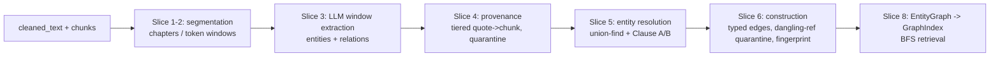
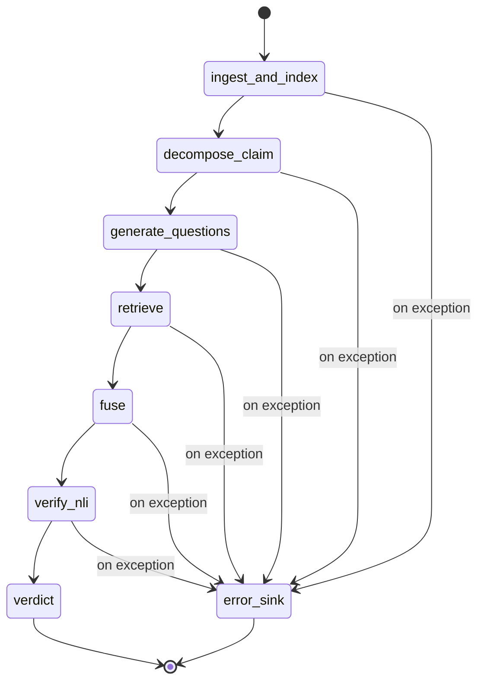

# LNCVS — Master Technical Reference

## Part 3 of 4 — The Graph Subsystem, Orchestration, and Evaluation

> This part covers the Phase 8 / "G2" graph subsystem end to end (segmentation,
> LLM extraction, provenance, the full entity-resolution saga, construction, and
> retrieval/traversal), the LangGraph orchestration layer, and the evaluation
> framework. The entity-resolution section is the most detailed because it was the
> system's hardest engineering problem and required four redesigns.

---

## 20. The graph subsystem — overview

**Purpose.** Provide a third retrieval source (`RetrievalSource.GRAPH`) that surfaces
evidence which dense and lexical retrieval miss — specifically, evidence about an
entity that does *not* share vocabulary with the query (the "Ben Joyce is Ayrton"
class of contradiction). It is an **index over the same chunk-ID space**, never a
new evidence store.

**Two construction paths.**
- **G1 (deterministic, model-free).** `build_entity_graph(chunks, GraphConfig)` —
  capitalized-token mention extraction + co-occurrence edges. "Zero models" is its
  defining property. Used by `GraphIndex.index()`.
- **G2 (LLM-extracted).** `build_graph_for_novel(cleaned_text, chunks, extractor)` —
  the full pipeline: segmentation → LLM window extraction → provenance resolution →
  entity resolution → graph construction. Loaded into a `GraphIndex` via
  `load_graph()`. **This is the path the graph-impact study actually uses.**

**Opt-in invariant.** No module outside `lncvs.graph` constructs or wires
`GraphIndex`/`GraphRetriever`. Only `scripts/evaluate_with_graph.py` does. The
LangGraph production pipeline never includes it.

The G2 pipeline is organized as "slices":



---

## 21. Segmentation — `graph/segmentation.py`

**Purpose.** Split `cleaned_text` into extraction windows that fit the extraction
model's effective context, in the **same coordinate space** chunking already uses
(so every offset is directly comparable to a `DocumentChunk` span — the single
cross-cutting correctness rule).

**Two-level output.** `ChapterSpan` (one per detected chapter, or per fallback
segment) and `ExtractionWindow` (the unit actually fed to extraction; equal to its
chapter unless the chapter exceeds the token budget, then split into overlapping
sub-windows sharing `chapter_index` and carrying a `window_index`).

**Algorithm.**
- **Chapter detection.** Try four heading regexes in priority order ("Chapter
  IV.", "Chapter 12", "Chapter the Fourth", numbered headings); use the first that
  yields ≥`MIN_CHAPTERS=3` headings. Front-matter before the first heading becomes
  `chapter_index=0`.
- **Fallback.** If no chapter structure, segment into fixed
  `FALLBACK_WINDOW_TOKENS=4000`-token windows with `WINDOW_OVERLAP_TOKENS=600`,
  paragraph-snapped.
- **Long-chapter split.** A chapter over `MAX_EXTRACTION_TOKENS=6000` is split into
  overlapping sub-windows; non-final boundaries are **snapped to the nearest
  paragraph break** within a tolerance, but the token budget is a hard constraint
  that always wins over the snap.
- **Token counting** uses `tiktoken` `o200k_base` (the GPT-4o family encoding), the
  only token mechanism in the module. Offsets are recovered exactly via
  encode/decode of whole-token prefixes.

Windows always cover `[0, len(text))` with no gaps. **Tests.**
`tests/graph/test_segmentation.py` — chapter detection, fallback, coverage,
boundary snapping.

---

## 22. LLM window extraction — `graph/llm_extraction/`

**Purpose.** Extract entities and relations explicitly stated in one window, each
with verbatim evidence quotes, via a `StructuredLLMClient`.

**Inputs/Outputs.** `WindowExtractor.extract(window_text, chapter_index,
window_index) -> WindowExtraction(entities, relations, events)`.

**Raw DTOs (`schema.py`).** `RawEntityMention(local_id ~ ^e[0-9]+$, name, type:
EntityType, aliases, evidence_quotes≥1)`, `RawRelation(subject_local_id,
object_local_id, relation_type, evidence_quotes≥1)`, plus `RawEvent`/`RawParticipant`/
`RawTemporal` (still defined but see below). `local_id`s are **window-local**, never
global. `RawRelation` deliberately does **not** pattern-constrain its local-id
references to `^e[0-9]+$` — live runs showed the LLM occasionally emits a
non-conforming placeholder (e.g. "OTHER") when it can't pin a referent; rejecting
the whole window over one bad reference is worse than letting it through and
quarantining the dangling reference downstream. `RawRelation` raises only if the
`relation_type` is `CO_OCCURS` (reserved for the G1 builder).

**JSON schema (`json_schema.py`).** A hand-written, provider-agnostic schema body
(`EXTRACTION_JSON_SCHEMA`), kept as an independent artifact from the Pydantic DTOs
(the provider's `"strict":True` requires every property in `required`, which doesn't
map cleanly onto Pydantic Optional/default semantics). `SCHEMA_VERSION =
sha256(schema)[:8]`.

**Hackathon cost optimization — events disabled on the wire.** The `"events"`
property was removed from `EXTRACTION_JSON_SCHEMA` and the event instructions
removed from the prompt, because `EventRecord`/`EventParticipation` never reach
`EntityGraph.from_records()` / `GraphIndex` / retrieval — events were the single
largest source of output tokens for zero retrieval benefit. `WindowExtraction.events`
defaults to `()`, so a response with no `events` key validates identically. The
event DTOs and construction code remain; re-enabling events is reverting this dict,
not a new feature.

**Prompt (`prompts.py`).** System rules: every entity/relation must include ≥1
verbatim `evidence_quotes` entry copied character-for-character; if no exact quote
supports a fact, omit it (omission > fabrication); use no outside knowledge of the
work; only emit relation types from the closed list; `local_id`s unique within the
response; resolve clear pronouns within the window but omit ambiguous cross-sentence
referents; conform exactly to the schema. Production extraction model:
**`gemini-2.5-flash`, temperature 0, `max_tokens=65536`** (the real output ceiling;
lower values truncated dense chapters mid-JSON).

**Service.** `LLMWindowExtractor` holds no state beyond the injected client;
`parse_window_extraction` is a pure parser that re-raises any `ValidationError` as a
plain `ValueError` (never lets a bare Pydantic error escape).

**Cache & reproducibility.** Extractions are cached to
`results/extraction_cache_<book>.jsonl`. Once populated, the graph is rebuilt
forever from the cache with **zero API calls** — the evaluation script uses a
`_NoCallStructuredClient` that raises on any cache miss, so a missing window simply
contributes nothing (fault-isolated, see §24). One Monte Cristo window (chapter 156)
is permanently skipped this way.

---

## 23. Provenance assignment — `graph/provenance/`

**Purpose (Slice 4).** The trust boundary between LLM output and the deterministic
graph: a fact reaches the graph only if at least one of its `evidence_quotes`
resolves to a real, indexed chunk. Everything else is **quarantined** into a
`RejectedFact`, never reaching entity resolution or construction.

### 23.1 Canonicalization — `canon.py`
`canonicalize_with_offsets(text) -> (canon_text, offsets)`: smart quotes/dashes/
ellipsis → ASCII, whitespace runs collapsed to one space, trimmed — with an exact
one-output-char-to-one-input-index offset map so match offsets recover true
cleaned-text offsets. **Both sides of every match go through the same `canon()`**
(the frozen §3 rule). Deliberately does **not** apply Unicode NFC normalization
(NFC can change length, requiring a many-to-many map); for English prose this is an
empirically safe scope limitation — a real NFC mismatch causes a Tier-3 failure
(quarantine), never a wrong match.

### 23.2 Tiered matching — `matching.py`
`resolve_quote(quote, window_text, ProvenanceConfig) -> QuoteMatch`:
- **Tier 1 (EXACT):** `canon(quote)` as a substring of `canon(window)`. First
  occurrence by offset is used; `ambiguous=True` if it occurs more than once.
- **Tier 2 (FUZZY), only if Tier 1 fails:** sliding fixed-length token window;
  score = fraction of exactly-matching token positions; accepted only if best score
  ≥ `fuzzy_overlap_threshold=0.95` **and** unique (no second window within
  `fuzzy_uniqueness_margin=0.03`). A non-unique fuzzy candidate is rejected outright
  (→ FAILED), never returned ambiguous.
- **Tier 3 (FAILED):** no match recorded.

`ProvenanceConfig.fingerprint()` makes every `QuoteMatch` independently
recomputable. **This same `resolve_quote` (Tier 1 only) is reused by `LLMFactVerifier`
for its quote trust boundary** (§17.3).

### 23.3 Service — `service.py`
`resolve_window_provenance(extraction, window_text, chapter_index, window_index,
window_char_start, chunks)`: for each raw fact, resolve every quote, convert
window-local match offsets to global (`window_char_start + match.offset`), find
overlapping chunks via `chunks_overlapping_span`, clip the span to each chunk, and
build `Provenance` records. A fact with ≥1 resolved chunk → `ResolvedFact`
(provenance guaranteed non-empty by construction — a type-level "no node without
provenance" guarantee); zero → `RejectedFact(reason="no evidence_quotes resolved to
any indexed chunk")`. Output: `WindowProvenanceResult` partitioning entities/
relations/events into resolved/rejected.

**Tests.** `tests/graph/provenance/` — canon offset correctness, all three match
tiers, ambiguity handling, resolved/rejected partition, real-novel provenance
(`test_phase8_provenance_real_novel.py`).

---

## 24. Entity resolution — `graph/entity_resolution/` — THE FOUR-REDESIGN SAGA

This is the system's hardest problem and deserves its own extended treatment. The
**conservative policy is mandatory**: merging is by **name/alias string equality
only** — no fuzzy similarity, no embedding clustering. This biases toward **false
splits over false merges**, because a missed alias only reduces multi-hop reach,
while **a false merge manufactures the wrong-character-evidence failure mode** that
the dataset evaluation identified as the project's dominant real-world error source.
`SAME_AS` relations never trigger a merge here — they are an ordinary typed edge,
handled in construction, never consulted by entity resolution.

**Entry point.** `resolve_entities(entity_facts) -> EntityResolutionResult(entities,
local_to_global)` — pure, deterministic. It calls `compute_components` (union-find),
then `merge_component` per component, and sorts final `EntityRecord`s by `entity_id`.
`local_to_global` maps `(chapter_index, window_index, local_id) → entity_id`;
quarantined local_ids are intentionally absent (callers must treat a missing key as
"reference cannot be honored").

### 24.1 The merge algorithm (final, ER4)

`compute_components(entity_facts)`:
1. Sort mentions by a **content-hash key** (`sha256(chapter:window:local_id:name)`)
   — fixed processing order independent of list/dict/hash-seed order.
2. Union-find over mentions, where two mentions union iff they **share a normalized
   merge key**.
3. Merge keys come from `norm_name()` of a mention's primary name and its
   (corroborated) aliases, filtered by the rules below.
4. `merge_component` picks the canonical name (most-frequent surface form →
   smallest first-appearance offset → lexicographic), the majority entity type
   (tie → `OTHER`), the content-hash `entity_id`, and the deduped union of
   provenance.

The merge-key rules evolved across four redesigns. Here is each stage, the bug it
fixed, and the residual limitation.

### 24.2 ER1 — naive name/alias equality (the original frozen §4 policy)

- **Approach.** Union any two mentions sharing any normalized name or alias.
- **Problem.** The LLM extractor routinely emits **generic referents** — bare
  pronouns ("he", "him"), demonstratives ("this man"), bare titles ("the major"),
  kinship terms ("my father") — as a mention's name or in its alias list. Under
  pure equality these act as **universal bridges**, transitively collapsing an
  entire novel's principal cast into one node.
- **Result → bug.** Catastrophic over-merge (Paganel, Glenarvan, Ayrton AND Ben
  Joyce in one node).

### 24.3 ER2 / ER3 — generic-referent exclusion

- **Solution.** `normalization.is_generic_referent(key)` returns True if a
  normalized key is empty or composed *entirely* of generic-referent tokens
  (`_GENERIC_REFERENT_TOKENS`: pronouns, determiners, generic person/role nouns,
  kinship terms, demonyms, generic object/place class nouns, plus expanded
  title-stripping in `_TITLE_PREFIXES`). The merge-key loop changed from `if key:`
  to `if key and not is_generic_referent(key):`. Excluding a purely-generic key can
  only ever *prevent* a merge (a benign false split), never force one.
- **ER3 audit (read-only, "prove it, don't assume surnames").** With generic
  referents excluded, a giant component **still** remained. The audit
  (`scripts/audit_er3_merge_keys.py`, results in `results/er3_audit_mc.json`)
  instrumented the exact union-find and quantified it:

  | Monte Cristo giant component | value |
  |---|---|
  | total mentions | 4,561 |
  | total components | 1,813 |
  | **giant component size** | **1,329 mentions** |
  | distinct primary names in the giant | **209** |
  | giant entity-type distribution | PERSON 1236, LOCATION 63, ORG 23, OTHER 6, OBJECT 1 |
  | spanning-tree edges holding it together | 208 |
  | giant size if ALL weak keys removed | **266** (down from 1,329) |

  The audit's ablation of merge-key *classes* proved the cause was **not** a single
  class but **weak keys collectively**: surnames (e.g. "danglars" bridged 11
  distinct primary names including "Albert's mother", "Baron Danglars", "Baroness
  Danglars"), particle-led surnames ("de Morcerf"), and **descriptive-epithet
  aliases** ("the dying man", "poor devil", "my lord") that the extractor listed as
  aliases. SAME_AS was confirmed to contribute nothing (it's a relation, not an
  alias).

### 24.4 ER4 — corroborated entity resolution (Clause A + Clause B)

The final redesign, implemented in `merge.py`. Two clauses, both empirically
validated against the real corpus *before* any production code changed (prototypes
`scripts/proto_er4.py`, `proto_er4b.py`).

**Clause A — corroborated-alias rule.** An alias is a valid merge key **only if its
normalized form also appears, elsewhere in the corpus, as some mention's own PRIMARY
name.** Genuine identity aliases ("Monte Cristo", "Lord Wilmore", "Ben Joyce")
satisfy this because some entity is introduced with that primary name; invented
epithets ("the dying man") never do, because no entity is named "the dying man." A
mention's own primary name is **never** subject to this check — Clause A polices only
untrusted *alias* claims.

```
primary_keys_corpus = { norm_name(m.name) for m in mentions if valid }
# a mention's alias contributes a key only if norm_name(alias) ∈ primary_keys_corpus
```

**Clause B — weak-surname rule.** A single-token key ("Danglars") or a particle-led
key ("de Villefort", particles `_NOBILIARY_PARTICLES = {de, d, du, des, la, le, von,
van, of, saint, st}`) is **WEAK** — on its own it collapses an entire family when the
text uses the bare surname for more than one member. But naively splitting all weak
keys shattered ordinary single-name characters (Paganel, Glenarvan, MacNabb). The
final rule has two refinements:

1. **A weak key is flagged AMBIGUOUS only if the corpus shows real evidence of
   multiple identities sharing it** — `_detect_ambiguous_keys` requires **2+ distinct
   relationship-category tags** (a gender/seniority contrast: Lord vs Lady, Baron vs
   Mademoiselle), **2+ distinct "other:X" distinguishing words**, or one of each. A
   surname always used the same way (or always bare) is **not** ambiguous and merges
   unconditionally like any strong key. Tags come from `_qualifier_tag`, which
   classifies the prefix attached to a surname:
   - a non-title, non-generic word → `"other:<word>"` (the **generalizable substitute
     for a given-name whitelist** — we don't need to know "Eugénie" is a first name,
     only that it isn't a title);
   - a recognized relationship marker → `male_senior` / `male_junior` /
     `female_married` / `female_unmarried`;
   - **gender-neutral formal titles** ("M.", "Monsieur", "Captain") deliberately get
     **no tag** (fall through to `None`, same as bare) — they don't distinguish *which*
     family member is meant, so giving them their own category wrongly split
     "M. Danglars" from "Baron Danglars" (the same man).
   - `_best_tag_for_key` tries every surface that produced the key (primary name
     first, then aliases) and returns the first non-None tag, so a bare alias
     ("Danglars") never silently masks a titled primary ("Baron Danglars").

2. **For an ambiguous key, resolution (`_resolve_ambiguous_keys`) groups by tag:**
   - mentions sharing the **same** tag always union with each other (agreeing
     repeatedly that "M. Danglars" means the same person is the normal case, not a
     conflict);
   - **bare (untagged) mentions join the most-frequent ("anchor") tag-group freely**
     (a bare reference carries no signal contradicting the default);
   - a **minority, conflicting** tag-group unions with the anchor (or another
     minority group) **only if at least one member of each side shares a second key**
     with a member of the other — checked against those **specific mentions' own
     keysets**, never an aggregated component's keyset (which would accumulate enough
     unrelated keys to spuriously "corroborate" almost anything — confirmed
     empirically as a real failure).

**Dead-code discovery (disclosed).** A "surname-core propagation" step (propagating
ambiguity from "de Morcerf" to bare "Morcerf") was implemented, then **proven inert**
by direct experiment — disabling it produced byte-identical entity/relation counts
on the full real corpus — because when a key's own occupants show ≤1 distinct tag,
the ambiguous path produces the identical grouping as the non-ambiguous path. It was
**removed entirely** (not left commented), and a misleadingly-named test was renamed
to reflect that Clause A, not propagation, is what rejects an uncorroborated bare
alias.

**Determinism.** Union-find processes mentions in content-hash order; `_union`
always makes the smaller index the root; ambiguous-key resolution iterates sorted
tags. Identical input → identical components across processes and hash seeds.

**Residual over-merge (disclosed, out of ER4 scope).** Two categories remain: (1)
genuine LLM extraction errors (e.g. an alias incorrectly cross-attributed between
Cavalcanti/Albert), and (2) genuine source-text naming overlap (e.g. "Mademoiselle
Noirtier de Villefort" legitimately shares tokens across Noirtier/Valentine). Both
were confirmed by inspecting the raw extraction cache and the novel text; neither is
fixable in entity resolution without violating the conservative no-fuzzy policy.

**Preserved identities (the ER4 acceptance list, verified via direct
`compute_components` calls).** Edmond Dantès, Count of Monte Cristo, Lord Wilmore,
Abbé Busoni, Sinbad the Sailor all remain correctly resolvable; Ben Joyce↔Ayrton
remains merged.

**Tests.** `tests/graph/entity_resolution/test_merge.py` (Clause A & B comprehensive,
13+ tests including the preserve-list and the corroboration edge cases),
`test_normalization.py` (title-stripping, `is_generic_referent`), `test_service.py`.

---

## 25. Graph construction — `graph/construction/`

**Purpose (Slice 6).** Assemble resolved entities + raw resolved relation/event facts
into final typed `EntityRelation`/`EventRecord`/`EventParticipation`, resolving every
window-local `local_id` through the `EntityResolutionResult` and quarantining
anything dangling — a **second trust boundary**.

**`build_graph(resolution, relation_facts, event_facts) -> ConstructedGraph`:**
- **Relations.** Resolve `subject_local_id`/`object_local_id` to global IDs; reject
  if either is unresolved (dangling) or if both resolve to the same entity
  (degenerate self-relation). Group surviving facts by `(subject_id, object_id,
  relation_type)` — **directional, stored exactly as extracted, never reordered**
  (reordering would invert asymmetric relations like `POSSESSES`). `weight` = count
  of distinct provenance chunks; provenance = deduped union.
- **Events.** Resolve every participant; reject the whole event if any participant
  is dangling. `event_id = make_event_id(predicate, sorted participant IDs,
  anchor.chunk_id, anchor.char_start)`. Group by event_id; build `EventRecord` +
  `EventParticipation` per `(entity, event, role)`. (Constructed but never used in
  retrieval — see §26.)
- **Fingerprint.** `compute_graph_fingerprint` canonically hashes sorted entities,
  relations, events, participations (including provenance) — order-independent. This
  is the reproducibility checksum for a whole graph; the graph-impact study records
  it per novel.

**`ConstructedGraph`** (frozen dataclass): `entities`, `relations`, `events`,
`participations`, `rejected_relations`, `rejected_events`, `fingerprint`.

**Scope decision (disclosed).** Events are built as fully typed, provenanced,
deduplicated data but kept **separate** from the BFS-facing `EntityGraph`, so Slice 8
could wire entities+relations into the already-tested G1 retrieval code immediately;
event-aware traversal is a disclosed, deferred enhancement.

**Tests.** `tests/graph/construction/` — direction preservation, dangling-reference
quarantine, fault isolation, real-service.

---

## 26. Graph index, traversal, and retrieval — `graph/` (builder, index, traversal, retriever)

### 26.1 `EntityGraph` — `builder.py` (the only `networkx` importer)
A thin wrapper around `networkx.Graph` plus a `canonical_name → entity_id` lookup.
Node/edge attributes are always the typed `EntityRecord`/`EntityRelation` (never raw
dicts). Two population paths:
- **G1 `build_entity_graph(chunks, config)`** — per chunk: `extract_mentions` →
  `upsert_entity` (merge by exact case-insensitive canonical name) → `upsert_relation`
  for every unordered pair of distinct entities in the chunk (a `CO_OCCURS` edge,
  weight = co-occurrence count, endpoints stored ascending).
- **G2 `EntityGraph.from_records(entities, relations)`** — pure assembly of
  already-resolved content (no merging). **Disclosed simplification:** the underlying
  `networkx.Graph` is simple (one edge per node pair); if G2 supplies multiple
  relation types for the same pair, they are **merged into one traversal edge**
  (weight summed, provenance unioned, relation_type = whichever sorts first) — for
  BFS purposes only. The full per-type relation list survives untouched in
  `ConstructedGraph.relations`. Relations are grouped by the *unordered* node pair so
  a swapped-direction duplicate is detected and merged, not silently overwritten by
  networkx.

### 26.2 Mention extraction — `extraction.py`
`extract_mentions(text, min_token_length)`: runs of consecutive capitalized words
(so "New York" merges) with a fixed stopword list breaking runs (so "Then John"
doesn't merge). Deterministic, rule-based, **zero NLP models** — deliberately weak
and over-inclusive. **The single shared function for both corpus side (construction)
and query side (entry resolution)** — the same shared-tokenization discipline BM25
uses; divergence would be a silent recall killer.

### 26.3 Traversal — `traversal.py` (pure, deterministic, no models)
- `resolve_entry_entities(graph, query_text, config)`: `extract_mentions` on the
  query, then **exact case-insensitive** `entity_id_by_name` lookup. **No fuzzy
  fallback** (deferred). Zero entries is a valid result.
- `score_chunks(graph, entry_ids, max_hops)`: the explicit chunk-scoring formula.
  Entry entities (hop 0) anchor via their own provenance with weight 1. A neighbor
  first reached at hop `h≥1` anchors via **its own full provenance** (not just the
  edge's), weighted by `edge.weight / (1 + h)`. This is the deliberate multi-hop
  behavior: expanding "London" → "John" lets John's *other* mentions (chunks about
  John that never mention London) surface as candidate evidence — scoring only the
  edge's provenance would collapse to plain co-occurrence lookup. Bounded BFS:
  each entity visited once, neighbors in ascending entity_id order.
- `rank_chunks(scores, top_k)`: best-first, ties by ascending chunk_id, capped.

### 26.4 `GraphIndex` (`Indexer`) and `GraphRetriever` (`Retriever`)
`GraphIndex` mirrors Chroma/BM25 exactly: `index(chunks)` (G1 build) or
`load_graph(entity_graph, chunks)` (G2), and `query(query_text, top_k)` →
`list[RetrievedEvidence(source=GRAPH, raw_score=chunk_score, ...)]`. Returns **only
chunk_ids** (wrapped in evidence), never node IDs or paths — the "graph never leaves
the chunk-ID space" invariant. Zero resolved entries → empty list (correct input to
INSUFFICIENT_EVIDENCE). `GraphRetriever` is the thin wrapper making it just "another
`RetrievalSource`" — `RetrievalOrchestrator` cannot tell it apart from semantic/
lexical except via the `source` field.

**Config.** `GraphConfig(max_hops=1 [1..2], min_entity_token_length=2)` with a
`fingerprint()`. **The exact-match entry-resolution limitation is load-bearing for
the graph-impact results:** `entity_id_by_name` only matches the single canonical
name `select_canonical_name` chose; correctly-merged non-winning aliases are
**unreachable by query**. ER4 fixed the *merges* but the retriever still can't
*reach* a non-winning alias — a key reason the graph contributed little downstream
(Part 4).

**Tests.** `tests/graph/` — builder determinism, from_records edge merging,
index/load_graph, traversal scoring, retriever, real-novel graph retrieval
(`test_phase8_graph_retrieval.py`).

---

## 27. Orchestration — `lncvs/orchestration/` (LangGraph, Phase 7)

**Purpose.** Run the linear pipeline as a compiled LangGraph `StateGraph`, while
*provably* preserving the behavior of the evaluation `PipelineRunner` (the
"equivalence oracle").

### 27.1 Model A — `GraphState` unchanged
`GraphState = {ledger, control}` is unchanged. `EvidenceLedger` remains the single
source of truth, mutated only through `LedgerService`; the graph adds **no second
mutation path**. (The rejected "Model B" would have hoisted ledger fields to
top-level LangGraph channels with `add` reducers — shattering the ledger and
bypassing `LedgerService` — "a rewrite wearing a port's clothes.")

### 27.2 Channels and reducers
`orchestration/state_channels.GraphChannels` declares `ledger` and `control` as
**whole-object channels with an explicit `last_write_wins` reducer**
(`reducers.py`), never the implicit default (honoring "never rely on default
overwrite for list fields"). This is valid **only because Phase 7 is strictly linear
with no parallel fan-out** — no two nodes write the same channel in one super-step.
A documented warning: if a later phase adds parallel fan-out (e.g. per-claim parallel
retrieval), this reducer choice must be revisited.

### 27.3 The eight nodes
`ingest_and_index → decompose_claim → generate_questions → retrieve → fuse →
verify_nli → verdict`, plus `error_sink`. **Each node calls the identical underlying
functions `PipelineRunner` calls, in the same order** — this is what makes "preserve
behavior" structural rather than hopeful.



- **`ingest_and_index` writes NOTHING to the ledger** — matching the oracle, which
  builds indices as local variables before any `LedgerService` call. This is the
  single most important faithfulness constraint.
- **Ablation is handled inside nodes, never via conditional edges.** Each node reads
  `run_context.variant` and branches with the identical inline conditional
  `PipelineRunner` uses (`if variant.use_bm25:`, `if variant.use_question_generation:`,
  `if variant.fusion_strategy is ROUND_ROBIN:`). Routing by ablation toggle would
  create a second place ablation logic could drift from the oracle.
- **`verify_nli` uses `CrossEncoderNLIVerifier`** — the LangGraph production path is
  cross-encoder-based; it has no `GraphRetriever` and no `LLMFactVerifier`. The
  `retrieve` node builds only semantic (+ optional BM25) retrievers.

### 27.4 Resources, error handling, no checkpointer
- **Resources never enter `GraphState`.** `PipelineResources` (graph-level: embedder,
  NLI model, LLM clients, configs) and `RunContext` (per-run: variant + the
  retrievers `ingest_and_index` builds) are plain dataclasses threaded exclusively
  via `config["configurable"]` — a `ChromaIndex` is not domain state.
- **Error handling.** Every node except `error_sink` is wrapped by
  `_node_error_boundary(stage)` — the single place a node exception becomes a routed,
  recorded `StageError` (appended to `control.errors`, `current_stage=ERROR`,
  conditional edge to `error_sink`). `error_sink` returns the partial ledger with **no
  fabricated verdict**. Per-backend retrieval tolerance (`degraded_sources`) is
  deliberately **not** wired (no existing production behavior to preserve; out of
  Phase 7 scope).
- **No checkpointer.** `build_graph()` compiles with none. `LedgerService` mutates in
  place and nodes return the same object reference — harmless only because there is no
  serialize/restore cycle; adding a checkpointer later requires reviewing that
  in-place mutation first.

### 27.5 The equivalence guarantee
`LangGraphPipeline` satisfies `LedgerProducer` structurally (same `chunking_config`
property + `run()` signature) without `evaluation/` importing `orchestration/`.
`tests/orchestration/test_graph_equivalence.py` asserts: for every
`standard_ablation_matrix()` variant, `LangGraphPipeline` and `PipelineRunner` given
identical injected models produce a **byte-identical `ledger_fingerprint`**.
`PipelineRunner` is retained permanently as the equivalence oracle.

**Two relocations Phase 7 required** (both to keep `orchestration/` from importing
`evaluation/`): `AblationVariant`/`FusionStrategy`/`standard_ablation_matrix` moved
to `schemas/`; `round_robin_fuse` moved to `orchestration/fusion_baselines.py`. Both
old locations re-export for backward compatibility, so no Phase 6 import site changed.

---

## 28. Evaluation framework — `lncvs/evaluation/`

**Purpose.** A pure, read-only consumer of `EvidenceLedger` that scores it against
gold labels, plus the thin runner that produces ledgers. Sits at the very bottom of
the dependency chain (may import everything; nothing imports it).

### 28.1 `PipelineRunner` — `runner.py`
The reference linear-pipeline executor and equivalence oracle. Injected once with
models/configs/caches (shared across runs); each `run()` builds a fresh
`ChromaIndex`/`BM25Index` scoped to a **`uuid4` collection name** (Chroma's ephemeral
client persists collections by name within a process, so a per-instance counter would
silently leak one narrative's chunks into another's results; collection names carry
no audit requirement, so uuid4 is correct here, not a violation of content-hash
discipline). Returns `EvidenceLedger` only. `LedgerProducer` is the `Protocol` both
it and `LangGraphPipeline` satisfy.

### 28.2 `EvaluationHarness` — `service.py`
Drives a `LedgerProducer` across a dataset, producing lightweight, fingerprinted
`EvaluationReport`s. For each example: load+chunk the narrative (with `source_id =
str(path)`, matching the runner exactly so gold chunk IDs match), map gold spans to
chunks, run the pipeline, and compute verdict/retrieval/citation/latency metrics.
`run_ablation` computes each ablated component's accuracy delta vs. the `full` variant.

- **Reports are lightweight** — `ledger_fingerprint` + aggregated metrics, never an
  embedded `EvidenceLedger` (embedding one would make `schemas/` depend on a ledger
  body and bloat reports). `AblationVariant` is stored as name + fingerprint strings
  only.
- **`persist_ledgers` is the single gate for ALL filesystem writes.** Default `False`:
  zero writes, `ledger_path` stays `None`. `True`: each ledger →
  `output_dir/ledgers/{example}_{variant}_{fingerprint}.json` and the report →
  `output_dir/{run_id}.json`. (`output_dir` only says *where*; `persist_ledgers` says
  *whether* — collapsing two partially-overlapping flags into one. Both fields were
  dead until this wiring, caught in the Phase 6 code review.)

### 28.3 Metrics — `evaluation/metrics/`
Every metric function has the shape `(EvidenceLedger, gold) -> metric | None` and
**never mutates** the ledger.
- **Verdict (`verdict.py`):** strictly **3-class over `VerdictEnum`** —
  `INSUFFICIENT_EVIDENCE` scored as its own class, never collapsed into a binary.
  Accuracy, macro P/R/F1, sparse confusion matrix, and
  `contradiction_detection_rate` = recall on CONTRADICTORY (**`None` when no
  gold-CONTRADICTORY examples exist**, never a silent 0).
- **Retrieval (`retrieval.py`):** Recall@k, Precision@k, MRR over the ledger's fused
  evidence (deduped, RRF-ranked) vs. gold chunk IDs. **Returns `None` (not 0) when
  `gold_chunk_ids` is empty** — retrieval metrics require gold relevance labels.
- **Citation (`citation.py`):** citation accuracy + hallucination rate over the
  union of `contradictions`+`supporting_evidence` (the only evidence actually cited).
  **Returns `None` when nothing was cited.**
- **Latency (`latency.py`):** per-stage and end-to-end durations from `ledger_log`
  timestamps — the one metric **not** subject to the determinism guarantee (wall-clock
  fields are the accepted exception).

The "never report a silent zero when gold input is absent" rule is the direct
evaluation-layer enforcement of the "retrieval metrics require gold labels; never
report partial metrics as complete" requirement.

### 28.4 Gold datasets and fingerprinting
- **Gold evidence is span-based (`GoldSpan`), never chunk-id-based** — chunk IDs
  change under re-chunking; spans are mapped to whichever chunks cover them at
  evaluation time (`map_spans_to_chunks`), so the same gold dataset stays valid across
  any chunking config.
- `ledger_fingerprint` (`fingerprint.py`) hashes the determinism-relevant ledger
  content (claims, questions, retrieved/fused evidence, NLI, classification, verdict)
  and **excludes** `ledger_log`/`reasoning_trace` timestamps.
- `datasets/phase6_gold.jsonl` includes one example per verdict class — including a
  dedicated `INSUFFICIENT_EVIDENCE` example ("Tom traveled to Japan…", with no gold
  evidence) — specifically to exercise the 3-class scoring.

### 28.5 Why evaluation was built before LangGraph
A deliberate, documented reorder of the original build sequence (Phase 6 before
Phase 7/8): evaluation improves research value and correctness immediately, while the
LangGraph port only changes execution plumbing, not pipeline semantics or any metric.
Evaluation is therefore robust to LangGraph landing later. `PipelineRunner` is
explicitly the seam LangGraph replaces/absorbs.

**Tests.** `tests/evaluation/` — every metric against hand-computed values, dataset
loading/span mapping, fingerprint determinism, runner dummy-case → CONTRADICTORY,
report persistence gating, fusion baselines.

---

## 29. The CLI gap (disclosed)

`lncvs/cli/` and `lncvs/configs/` are **empty packages** with docstrings stating
"not yet implemented." `Project_spec.md` §5 and `CLAUDE.md` both list a CLI as a
Version 1 deliverable; it does not exist. The de-facto interface is the `scripts/`
directory (Part 4) — `evaluate_with_graph.py`, `validate_long_narrative.py`,
`evaluate_dataset.py`, and the audit/diagnostic scripts. This is a genuine,
verifiable gap between the spec's acceptance criteria and the implementation.

---

*Continued in Part 4 — project evolution (Phase 0→8, the H-phases, the verifier
evolution), every major engineering decision, the core algorithms, the experimental/
diagnostic journey with measured numbers, prompt engineering, configuration
reference, and the important-classes catalogue.*
