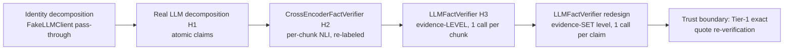
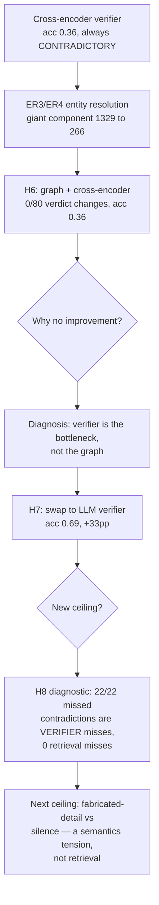
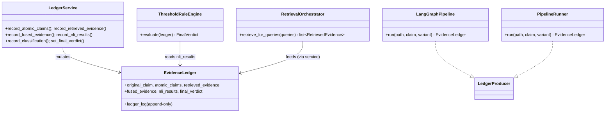

# LNCVS — Master Technical Reference

## Part 4 of 4 — Evolution, Decisions, Algorithms, the Experimental Journey, Prompts, and Configuration

> This final part reconstructs how the system was built and why, catalogues every
> major engineering decision with its reasoning, specifies the core algorithms,
> documents the complete experimental/diagnostic journey with measured numbers,
> extracts every production prompt, and gives the configuration and important-classes
> reference.

---

## 30. Project evolution — the phase history

The system was built in numbered phases. **The executed order differs from the
originally-planned order in two documented, intentional places** (recorded so future
sessions don't "fix" them back). The pattern at every phase: Problem → Solution →
Result → Remaining limitation.

### Phase 0 — schemas + typed ledger + rule-engine interface
- **Problem.** Everything downstream needs typed contracts and a write-once ledger.
- **Solution.** `schemas/` (all models + enums), `EvidenceLedger` + `LedgerService`,
  `RuleEngine` ABC + `RuleEngineConfig`.
- **Result.** The data-contract foundation; the rule-engine interface exists before
  any NLI to populate it.
- **Limitation.** No concrete engine yet.

### Phase 1 + 1.5 — single-retriever vertical slice + determinism infra
- **Problem.** Prove a correct end-to-end path before adding breadth.
- **Solution.** Ingestion → chunking → `ChromaIndex` → `SemanticRetriever`; then the
  determinism infrastructure — `CachingEmbedder`, deterministic evidence IDs, config
  fingerprinting.
- **Result.** A correct semantic-only slice; determinism became testable, not assumed.
- **Limitation.** Single source; no claim decomposition yet.

### Phase 2a/2b — claim decomposition + question generation
- **Problem.** Complex claims retrieve ambiguously; some contradictions aren't
  semantically similar to the claim.
- **Solution.** `reasoning/decomposition/` and `reasoning/questions/`, both via the
  shared `llm/` abstraction with caching.
- **Result.** Atomic claims + probe questions, both deterministic via input-hash
  caching.
- **Limitation.** Not yet wired to retrieval.

### Phase 3 — retrieval integration (inserted ahead of BM25/fusion)
- **Problem.** Fusion is meaningless without claim-linked evidence from multiple
  sources to fuse *for*.
- **Solution.** Claim-agnostic `Retriever`/`Indexer` + `RetrievalOrchestrator` that
  stamps claim/query provenance at the ledger boundary.
- **Result.** Evidence is claim-linked; the linkage invariant is enforced at the
  write boundary.
- **Reorder note.** The original sequence put BM25/fusion *before* any claim/query
  integration — which would have meant fusing evidence with no claim linkage to fuse
  for. Integration was inserted first once that dependency became clear.

### Phase 4 — BM25 + RRF fusion
- **Problem.** Semantic retrieval alone misses exact-term matches; scores across
  sources are incomparable.
- **Solution.** `BM25Index` (shared tokenizer), RRF fusion on ranks. `evidence_id`
  gains `source` in its hash to prevent cross-source collisions.
- **Result.** Hybrid retrieval; deterministic, source-collision-free evidence IDs.

### Phase 5 — NLI verification + verdict construction
- **Problem.** Need an evidence→verdict step that the rule engine, not an LLM, owns.
- **Solution.** `reasoning/nli/` (evidence-level `CrossEncoderNLIVerifier`, derived
  label map) + `rules/classification.classify()` (the single threshold owner) +
  `ThresholdRuleEngine`. **No orchestration module** — wiring is thin and local to
  the Phase 5 acceptance test (per the review's instruction not to build a throwaway
  driver LangGraph would replace).
- **Result.** The §14 dummy case resolves to CONTRADICTORY end-to-end.

### Phase 6 — evaluation framework (promoted ahead of LangGraph)
- **Problem.** No way to measure quality; gold labels needed.
- **Solution.** `evaluation/` — `PipelineRunner`, `EvaluationHarness`, pure metrics,
  JSON/matplotlib reporting.
- **Result.** Reproducible metrics; the 3-class scoring with `INSUFFICIENT_EVIDENCE`.
- **Reorder note.** Originally planned *after* LangGraph; promoted because evaluation
  improves research value/correctness immediately while the port only changes plumbing.

### Phase 7 — LangGraph integration
- **Problem.** Need real orchestration without changing semantics.
- **Solution.** `orchestration/` — an 8-node `StateGraph` over the unchanged
  `GraphState`, `last_write_wins` channels, node-internal ablation. Two relocations
  to `schemas/`/`orchestration/`.
- **Result.** Cross-variant byte-identical `ledger_fingerprint` equivalence vs.
  `PipelineRunner`.

### Phase 8 / "G2" — the graph subsystem (V2 entry gate opened)
- **Problem.** Dense+lexical retrieval misses vocabulary-mismatch contradictions.
- **Solution.** The full G2 pipeline (segmentation → LLM extraction → provenance →
  entity resolution → construction → BFS retrieval), opt-in, wired only in
  `evaluate_with_graph.py`.
- **Result.** A working graph retrieval source; real graphs built and cached for both
  novels.
- **Limitation.** The exact-match entry-resolution limitation and the verifier
  saturation (below) meant the graph contributed little downstream.

### The H-phases (hackathon dataset evaluation + the verifier/ER saga)
Run on the real `data/train.csv` (80 rows: 51 `consistent` / 29 `contradict`) and
`test.csv` (unlabeled). These are documented in `scripts/` headers and `results/`
artifacts rather than `CLAUDE.md`'s phase list.

- **H1** — real Gemini decomposition (replacing the FakeLLMClient identity stub),
  cached to `decomposition_cache.jsonl`.
- **H2/H3** — `FactVerifier` protocol; `CrossEncoderFactVerifier`; `LLMFactVerifier`
  (later redesigned to evidence-set level).
- **H4** — verifier selectable via a `VERIFIER_MODE` constant (`cross_encoder`/`llm`),
  with checkpoint namespacing so switching modes can't replay stale predictions.
- **H4.5** — a 20-row stratified comparison of cross-encoder vs. LLM verifier; root
  cause of poor LLM-verifier performance diagnosed as a **retrieval failure** (the
  retrieved evidence for several gold-contradict rows was irrelevant — RRF at the
  floor, no lexical/semantic connection).
- **ER3/ER4** — the entity-resolution audit and redesign (Part 3 §24).
- **H6** — final cross-encoder evaluation after ER4 (below).
- **H7** — the LLM-verifier switch (the metric-improvement slice, below).
- **H8** — the missed-contradiction diagnostic (below).

---

## 31. Verifier evolution (a dedicated decision history)

1. **Identity decomposition.** Early phases used a `FakeLLMClient` that passed the
   constructed claim through as a single atomic claim. Signature in old checkpoints:
   uniform `fused_evidence_count: 10` per row.
2. **Real atomic claims (H1).** Gemini decomposition produced multiple atomic claims
   per row (varied `fused_evidence_count`), activating real per-claim verification.
3. **CrossEncoder verifier (H2).** Re-labels NLI; the production/LangGraph verifier.
   Its failure mode on this dataset: a **near-degenerate always-CONTRADICTORY
   classifier** (100% CONTRADICTORY predictions, CONSISTENT recall 0.0) — structurally
   insensitive to retrieval/graph quality.
4. **LLM verifier, evidence-level (H3 original).** One call per (claim, chunk) — but
   one noisy chunk could flip a claim before the model saw the others.
5. **LLM verifier, evidence-SET level (redesign).** One call per (claim, full evidence
   set); reasons across all passages jointly. The architectural rationale and the
   "still not the LLM deciding the verdict" framing are in Part 2 §17.3.
6. **Trust boundary.** Every cited quote re-verified as an exact substring of some
   evidence record (Tier-1 `resolve_quote`); a no-quote SUPPORTED/CONTRADICTED or an
   unverifiable quote raises, never silently downgrades.

**Rule-engine interaction (one-directional evidence).** `ThresholdRuleEngine` Rule 1
(any CONTRADICTED claim → CONTRADICTORY) means additional evidence can never *retract*
an already-fired contradiction. This is why the evidence-set redesign mattered: it
moved the "weigh everything together" step to *before* the contradiction can fire,
rather than letting one chunk fire it.

---

## 32. The experimental & diagnostic journey (with measured numbers)

This is the empirical heart of the project. All numbers are from `results/` artifacts
on `data/train.csv` (n=80; 51 consistent / 29 contradict ≈ 64%/36% — so a trivial
"always CONSISTENT" classifier scores ~64%, the critical baseline for reading every
accuracy number below).

### 32.1 H4.5 — cross-encoder vs. LLM verifier (20-row stratified)
- Cross-encoder on the full sample: accuracy **0.35**, macro-F1 **0.173**, CONSISTENT
  recall **0.0**, CONTRADICTORY recall **1.0** (it predicted CONTRADICTORY for
  everything — confusion matrix: all 13 gold-CONSISTENT → predicted CONTRADICTORY).
- **Diagnosis:** the LLM verifier couldn't be fairly compared because retrieval for
  several gold-contradict rows surfaced irrelevant evidence. Root cause = retrieval,
  not the verifier. (Follow-up `diagnose_retrieval_recall.py` confirmed
  `evaluate_with_graph` never exercises probe questions — `build_retrieval_queries(…,
  [])`.)

### 32.2 H6 — final cross-encoder evaluation after ER4
From `results/graph_impact_summary_cross_encoder.json`:

| Condition | Accuracy | Macro-F1 |
|---|---|---|
| Baseline (chroma+bm25) | 0.359 | 0.176 |
| With graph (chroma+bm25+ER4 graph) | 0.359 | 0.176 |

- **Graph stats:** Castaways 607 entities / 724 relations; Monte Cristo 1,869
  entities / 1,780 relations (events 0 — disabled). Graph contributed evidence on
  44/80 rows; `graph_only_contribution_rate` 0.55.
- **Verdict changes from adding the graph: 0/80.** ER4's graph had **literally zero
  effect** on the cross-encoder's output.
- **Mechanistic explanation:** (a) verifier near-degeneracy (always CONTRADICTORY,
  insensitive to evidence); (b) rule-engine evidence one-directionality; (c) evidence
  dilution; (d) exact-string entity-lookup unreachability of non-winning aliases.
- **Measurement-validity finding (disclosed honestly):** the previously-stated
  "baseline" (accuracy 0.50, macro-F1 0.3228) was generated by an *identity-
  decomposition* pipeline (uniform `fused_evidence_count: 10`, predating real
  decomposition by file timestamp) and is **not** comparable. Within-run isolation
  (baseline vs. with-graph in the same invocation) was used as the clean way to
  isolate ER4's true marginal effect — which was exactly 0.0.

### 32.3 H7 — the LLM-verifier switch (the metric-improvement slice)
**Change applied:** `VERIFIER_MODE` flipped from `cross_encoder` to `llm`, with
`VERIFIER_PROVIDER="openai"` (`gpt-4o-2024-08-06`, temperature 0) because the Gemini
key was unavailable. Verified zero regressions (758/758 tests pass). Other candidate
improvements were measured and **dropped**: decomposition dedup (only 2.8% real
redundancy across 140 cached decompositions — not worth the risk); rule-engine
corroboration (deferred to avoid confounding attribution).

From the LLM checkpoints (`graph_impact_{baseline,with_graph}_train_llm.jsonl`):

| Metric | Cross-Encoder (H6) | **LLM verifier baseline** | **LLM verifier with-graph** |
|---|---|---|---|
| Accuracy | 0.359 | **0.690** | 0.671 |
| Macro-F1 | 0.176 | **0.340** | 0.315 |
| CONSISTENT recall | 0.0 | 1.0 | 1.0 |
| CONTRADICTORY recall (CDR) | 1.0 | **0.12** | 0.08 |
| Errored rows | — | 9/80 | 10/80 |
| n evaluated | — | 71 | 70 |

- **The verifier was the dominant bottleneck:** +33 accuracy points from one change,
  with zero retrieval/graph work — confirming the H6 diagnosis exactly.
- **The bias flipped, not balanced:** cross-encoder over-fired CONTRADICTORY (recall
  1.0, CONSISTENT 0.0); the LLM verifier under-fires it (CDR 0.08–0.12, CONSISTENT
  recall 1.0). The 0.69 accuracy is only **~5 points above the trivial 64%
  always-CONSISTENT baseline** — the contradiction-detection job is essentially still
  unsolved.
- **With-graph slightly *worse* than baseline (0.671 vs 0.690):** unlike the
  cross-encoder's 0/80, the LLM verifier *is* sensitive to evidence differences —
  **7/80 rows changed** (rows 43, 50, 57, 88, 107, 113, 137): one genuine correction
  (row 137, a contradiction correctly caught via graph evidence), one genuine
  regression (row 113), and the rest quote-verification trust-boundary differences
  (the fused evidence *set* differs between conditions, changing which quotes are
  citable). At n=80 this swing is within noise — not "the graph hurts."

### 32.4 H8 — the missed-contradiction diagnostic (locating the next ceiling)
`scripts/diagnose_missed_contradictions.py` re-ran all **22** gold-CONTRADICTORY rows
the LLM verifier called CONSISTENT, instrumented to show what evidence reached the
verifier and what it returned (zero new API calls — pure cache replay). Result
(`results/missed_contradiction_diagnosis.json`):

| Category | Count |
|---|---|
| **Retrieval miss** (zero fused evidence reached the verifier) | **0 / 22** |
| **Verifier miss** (full evidence reached it; it never fired CONTRADICTED) | **22 / 22** |

- Every missed row had a full 10-chunk evidence set for every atomic claim. The
  bottleneck is **not retrieval** — ruling out the graph-reachability fix and
  probe-query tuning as fixes for *this* failure mode.
- **The mechanism:** these gold-contradict claims fabricate *specific invented
  details* on top of a true premise (an invented date, ritual, causal mechanism, or
  dialogue). The source text is **silent** on the specific, rather than explicitly
  contradicting it. E.g. "Faria was shipped to the Château d'If" → SUPPORTED; "…**in
  1815**" → NOT_MENTIONED (the text never states the year). The verifier behaves
  exactly as instructed ("absence of evidence is NEVER contradiction") — which is
  itself a direct implementation of the project's `INSUFFICIENT_EVIDENCE`-never-
  CONTRADICTORY architecture. Catching "invented detail never mentioned" as a
  contradiction would require a closed-world assumption the system deliberately
  refuses. **This is a genuine dataset/semantics tension, not a prompt bug.**

### 32.5 Long-narrative validation (scale proof)
`scripts/validate_long_narrative.py` on Castaways (~139k words, 826k chars, 1,424
chunks): the real LangGraph pipeline executes at scale, peak RSS ~809 MB, 0 NLI
truncations (validating the 700/120 chunk size), determinism match True. (Per-claim
sanity on the synthetic gold set was mixed — cross-encoder behavior — confirming the
verifier limitation, not a pipeline failure.)

### Journey summary

---

## 33. Major engineering decisions (the reasoning behind each)

| # | Decision | Why |
|---|---|---|
| 1 | **Deterministic content-hash IDs everywhere** (chunk, claim, question, query, evidence, entity, event) | Same input → same ID across runs/processes; enables dedup across indices with no reconciliation, and reproducible audit. `uuid4` is used **only** for non-audit ephemera (Chroma collection names, ledger-event IDs). |
| 2 | **Input-hash caching of every model call** (`CachingEmbedder`/`CachingLLMClient`/`CachingStructuredLLMClient`/`CachingNLIModel`) | Determinism by construction. Cache key always namespaced by config `fingerprint()` so a config change can't serve a stale result. JSONL caches are committable → rebuild forever with zero API calls. |
| 3 | **Cache key = (fingerprint, rendered prompt), not a prompt-version field** | The rendered prompt already contains the template text, so a template edit self-invalidates the cache. `prompt_version` is audit provenance only. |
| 4 | **The ledger is write-once and append-only, mutated only via `LedgerService`** | Auditability; the full how-we-got-here history survives; referential integrity enforced at the write boundary. |
| 5 | **The ledger stores chunk IDs, not chunk bodies** | At 100k-word scale, passing chunk text through state is a bottleneck. |
| 6 | **`GraphState = {ledger, control}`, split strictly** | The rule engine consumes only the ledger; orchestration concerns (retries, errors, stage) must never pollute the audit trail, and vice versa. |
| 7 | **The rule engine, never an LLM, produces the verdict** | The cardinal project invariant. LLMs may decompose/score/verify; only deterministic Python maps the ledger to a `FinalVerdict`. |
| 8 | **Thresholds live in exactly one pure function (`classify`)** | Two call sites (verdict + explainability trace) agree by construction because the function is pure — no double-threshold path, no circular "engine reads its own output." |
| 9 | **CONTRADICTED dominates SUPPORTED; UNRESOLVED → INSUFFICIENT_EVIDENCE, never CONTRADICTORY** | A confirmed contradiction is stronger than a coverage gap; a missing-evidence case must never be mislabeled a contradiction. Tested at three layers. |
| 10 | **Protocols at every seam** (`Embedder`, `Indexer`, `Retriever`, `LLMClient`, `StructuredLLMClient`, `NLIModel`, `FactVerifier`, `RuleEngine`, `LedgerProducer`) | Dependency injection + testability; a real and a fake implementation per seam; swap providers/runners without touching consumers. |
| 11 | **Third-party SDKs confined to one file each** | Contains the blast radius of any vendor change; keeps the rest of the codebase pure and testable. |
| 12 | **NLI direction pinned (premise=evidence, hypothesis=claim) + stored on every result** | Silently reversible; a swap inverts every verdict. Pinned by a regression test and made auditable. |
| 13 | **NLI label map derived from the model's own `id2label`, raising on mismatch** | Different checkpoints order classes differently; a hardcoded order would invert verdicts silently. |
| 14 | **RRF over score normalization** | BM25 (unbounded) and cosine (`[0,1]`) scores are incomparable; ranks are always comparable. |
| 15 | **`FusedEvidence` minimal (no `source_ranks`)** | Per-rank detail already lives in `retrieved_evidence` (the single source of truth); denormalizing risks drift and is lossy with >1 query per source. `FusionConfig.fingerprint()` restores recomputability. |
| 16 | **Quote verification as a hard trust boundary** (graph extraction; LLM verifier) | LLM output reaches the graph/verdict only if its evidence quotes resolve to real indexed chunks (graph: tiered; verifier: Tier-1 exact). Hallucinated citations are rejected outright, never silently dropped. |
| 17 | **Provenance everywhere; "no node/edge/evidence without provenance"** | Every verdict must trace to a chunk and span; a fact with zero resolved chunks is quarantined, making the invariant type-level. |
| 18 | **Conservative entity resolution (string equality only, bias to false splits)** | A false merge manufactures the wrong-character-evidence failure mode (the dominant real error); a false split only reduces multi-hop reach. |
| 19 | **Graph is opt-in and never in the LangGraph node path** | The V1 vertical slice stays clean and graph-free; the graph is an additive `RetrievalSource` wired only in evaluation, its production promotion explicitly deferred. |
| 20 | **Events constructed but disabled on the wire** | Events were the largest output-token cost for zero retrieval benefit; removing them from the schema/prompt is a cost optimization, reversible by reverting one dict. |
| 21 | **Evaluation before LangGraph (reorder)** | Evaluation improves correctness immediately; the port only changes plumbing. |
| 22 | **`persist_ledgers` as the single write gate** | Avoids two partially-overlapping flags; a config field read nowhere is as forbidden as a swallowed exception. |
| 23 | **Span-based gold labels, not chunk-id-based** | Chunk IDs are content hashes that change under re-chunking; spans stay valid across any chunking config. |
| 24 | **LangGraph `last_write_wins` channels, no checkpointer** | Valid only because the graph is strictly linear; both choices are documented as requiring review if parallel fan-out or a checkpointer is ever added. |

---

## 34. Core algorithms (specification)

### 34.1 Reciprocal Rank Fusion (`fusion/rrf.py`)
- **Inputs:** claim-stamped `list[RetrievedEvidence]`, `FusionConfig(rrf_k=60, top_k_fused=10)`.
- **Output:** per-claim, deduped, ranked `list[FusedEvidence]`.
- **Steps:** group by `(claim, chunk)`; `rrf_score = Σ 1/(rrf_k + rank)` over all
  contributions; collect distinct sources/query_ids; sort per claim by `(-rrf_score,
  chunk_id)`; cap at `top_k_fused`.
- **Complexity:** O(N log N) per claim (N = evidence records). **Failure:** unstamped
  evidence → raise.

### 34.2 Threshold classification (`rules/classification.py`)
- **Inputs:** `nli_results`, `atomic_claim_ids`, `RuleEngineConfig`.
- **Output:** `ClassificationOutcome(statuses, contradictions, supporting_evidence,
  unsupported_claim_ids)`.
- **Per claim:** CONTRADICTION ≥ `contradiction_threshold` → CONTRADICTED; else
  ENTAILMENT ≥ `entailment_threshold` → SUPPORTED; else UNRESOLVED. **Pure.**

### 34.3 Rule precedence (`rules/threshold_engine.py`)
- Rule 1 (any CONTRADICTED) → CONTRADICTORY; Rule 2 (any UNRESOLVED, strict policy) →
  INSUFFICIENT_EVIDENCE; Rule 3 → CONSISTENT. Rule 1 before Rule 2. Lenient policy
  collapses Rule 2 into Rule 3.

### 34.4 Tiered quote resolution (`graph/provenance/matching.py`)
- Tier 1 exact canonical substring (first occurrence; ambiguous if >1) → Tier 2
  bounded fuzzy token alignment (accept iff overlap ≥0.95 **and** unique within 0.03)
  → Tier 3 FAILED. **Complexity:** Tier 2 is O(W·Q) tokens (sliding window). Reused by
  the LLM verifier (Tier 1 only).

### 34.5 Entity resolution union-find (`graph/entity_resolution/merge.py`)
- **Inputs:** `list[ResolvedFact]` (entity mentions).
- **Steps:** sort by content hash; build `primary_keys_corpus` (Clause A); build
  per-mention key→surfaces map (primary name + corroborated aliases, excluding
  generic referents); detect ambiguous weak keys (Clause B: ≥2 distinct qualifier
  tags); union all non-ambiguous keys unconditionally; resolve ambiguous keys by
  tag-group (within-tag free union; bare → anchor; minority → corroborated pairwise).
- **Complexity:** ~O(M·α(M)) union-find over M mentions, plus O(K) ambiguity scan.
  **Determinism:** content-hash order + smaller-index-root + sorted-tag iteration.

### 34.6 Bounded BFS chunk scoring (`graph/traversal.py`)
- `score(chunk) = Σ over visited entities' provenance chunks of (discovery_weight /
  (1 + hop))`. Entry entities hop 0 weight 1; hop-h neighbor anchors via its **own
  full provenance** weighted by `edge.weight/(1+h)`. Bounded by `max_hops` (1–2),
  each entity once, neighbors ascending. **The multi-hop value** is surfacing a
  neighbor's *other* mentions.

### 34.7 Segmentation windowing (`graph/segmentation.py`)
- Detect chapters (4 regexes, ≥3 headings) or fall back to fixed token windows; split
  any chapter over `MAX_EXTRACTION_TOKENS=6000` into overlapping (`600`) sub-windows,
  paragraph-snapped (snap loses to the token budget). Exact tiktoken offset recovery.

---

## 35. Prompt engineering (every production prompt)

All prompts are content-versioned (`PROMPT_VERSION = sha256(template)[:8]`), recorded
as audit provenance, and self-invalidating in caches via the rendered prompt text.

### 35.1 Claim decomposition (`reasoning/decomposition/prompts.py`)
- **Purpose:** claim → JSON array of atomic, self-contained assertions.
- **Constraints:** output ONLY a JSON array of strings; one indivisible assertion
  each; resolve all pronouns; add nothing unstated; omit nothing stated.
- **Expected output:** `["John played piano", "John used both hands", "the event
  occurred in London"]`.
- **Failure handling:** markdown-fence stripping; raise on malformed JSON / non-array
  / non-string / **zero claims** / over the limit.

### 35.2 Question generation (`reasoning/questions/prompts.py`)
- **Purpose:** atomic claim → JSON array of probe questions that, if answered yes,
  would *contradict* the claim.
- **Constraints:** genuine questions (ask, never assert a new fact); stay on the
  claim's subject; output `[]` if none.
- **Expected output:** `["Did John lose an arm?", "Did John suffer a hand injury?"]`
  or `[]`.
- **Failure handling:** empty is VALID (`[]`); non-`?` candidates filtered; raise only
  on malformed shape.

### 35.3 Graph extraction (`graph/llm_extraction/prompts.py`)
- **Purpose:** window text → entities + relations, each with verbatim evidence quotes.
- **Constraints:** every fact needs a character-for-character `evidence_quotes`
  entry; omit anything without an exact quote; no outside knowledge; only closed-list
  relation types; window-unique `local_id`s; resolve only unambiguous pronouns;
  conform to the JSON schema. Events disabled (cost).
- **Expected output:** conforms to `EXTRACTION_JSON_SCHEMA` (`entities[]`,
  `relations[]`).
- **Failure handling:** provider strict mode + Pydantic re-validation; any shape
  violation → `ValueError`; truncation → raise (raise max_tokens).

### 35.4 Fact verification, evidence-set level (`reasoning/fact_verification/llm_prompts.py`)
- **Purpose:** one atomic fact + the COMPLETE evidence set → one verdict
  (SUPPORTED/CONTRADICTED/NOT_MENTIONED) + confidence + verbatim quotes + explanation.
- **Constraints (system prompt):** NOT_MENTIONED is the default — absence is NEVER
  contradiction; CONTRADICTED only on explicit incompatibility; SUPPORTED may span
  passages; non-NOT_MENTIONED needs ≥1 verbatim quote from some passage; NOT_MENTIONED
  needs empty quotes; use ONLY the passages, no outside knowledge of the novel;
  conform to the schema; reason across the full set, not any single passage.
- **Expected output:** conforms to `FACT_VERIFICATION_JSON_SCHEMA`.
- **Failure handling:** no-quote SUPPORTED/CONTRADICTED → raise; quote not an exact
  substring of any evidence → raise; malformed JSON → raise. Never silently downgrades.

---

## 36. Configuration reference (every important knob)

| Config | Field | Default | Production value (real runs) |
|---|---|---|---|
| `ChunkingConfig` | `chunk_size` | — | **700** |
| | `overlap` | — | **120** |
| `EmbeddingConfig` | `model_name` | — | **all-MiniLM-L6-v2** |
| | `device` | `cpu` | cpu |
| | `normalize_embeddings` | `True` | True |
| `RetrievalConfig` | `top_k` | 5 | **10** (per query) |
| `FusionConfig` | `rrf_k` | **60** | 60 |
| | `top_k_fused` | **10** | 10 |
| `DecompositionConfig` | `max_atomic_claims` | **10** | 10 |
| | model | — | **gemini-2.5-flash**, temp 0 |
| `QuestionGenerationConfig` | `max_questions_per_claim` | **5** | (built; not exercised in graph study) |
| `NLIConfig` | `model_name` | — | **cross-encoder/nli-deberta-v3-base** |
| | `max_length` | **256** | 256 |
| `RuleEngineConfig` | `contradiction_threshold` | — | **0.9** (raised from 0.5) |
| | `entailment_threshold` | — | default |
| | `consistency_requires_entailment` | **True** | **False (lenient)** in real runs |
| `GraphConfig` | `max_hops` | **1** (1–2) | 1 |
| | `min_entity_token_length` | **2** | 2 |
| `ProvenanceConfig` | `fuzzy_overlap_threshold` | **0.95** | 0.95 |
| | `fuzzy_uniqueness_margin` | **0.03** | 0.03 |
| Segmentation consts | `MAX_EXTRACTION_TOKENS` | **6000** | 6000 |
| | `FALLBACK_WINDOW_TOKENS` | **4000** | 4000 |
| | `WINDOW_OVERLAP_TOKENS` | **600** | 600 |
| Extraction | model / `max_tokens` | — | **gemini-2.5-flash / 65536**, temp 0 |
| LLM verifier (H7) | model | — | **gpt-4o-2024-08-06**, temp 0, `max_tokens` 2048 |
| LLM retry | `_MAX_RETRIES` / backoff | **5 / 5s ×2** | (Gemini clients) |
| `EvaluationConfig` | `k_cutoffs` | **[5, 10]** | [5, 10] |
| | `persist_ledgers` | **False** | False (default) |

**Threshold-tuning history (`scripts/analyze_thresholds.py`, `sweep_thresholds.py`).**
NLI scores are independent of the rule-engine thresholds (only `classify()` applies
them), so the harness runs NLI once per row (cache replay, zero API calls) and sweeps
thresholds analytically. Two iterations: (1) `consistency_requires_entailment` set to
`False` (lenient) because the cross-encoder almost never emits ENTAILMENT for a
paraphrased claim vs. one chunk, making strict CONSISTENT structurally unreachable;
(2) `contradiction_threshold` raised 0.5 → 0.9 because every true contradiction scored
≥0.94 while the only sub-0.9 contradictions on gold-CONSISTENT rows (0.62, 0.64) were
spurious — raising the bar dropped those with zero loss of true-contradiction recall.

---

## 37. Important classes (responsibilities, methods, collaborators)

| Class | Responsibility | Key methods | Protocols | Collaborators |
|---|---|---|---|---|
| `LedgerService` | the only ledger mutator | `record_*`, `set_final_verdict` | — | `EvidenceLedger` |
| `RetrievalOrchestrator` | stamp claim/query/source provenance | `retrieve_for_queries` | uses `Retriever` | `RetrievedEvidence` |
| `SemanticRetriever`/`BM25Retriever`/`GraphRetriever` | claim-agnostic retrieval | `retrieve` | `Retriever` | `ChromaIndex`/`BM25Index`/`GraphIndex` |
| `ChromaIndex`/`BM25Index`/`GraphIndex` | build + query an index | `index`/`load_graph`, `query` | `Indexer` | `Embedder`, `EntityGraph` |
| `CachingEmbedder` | embedding cache | `embed_texts`, `embed_query` | `Embedder` | `EmbeddingCache` |
| `LLMClaimDecomposer` | claim → atomic claims | `decompose` | uses `LLMClient` | parser, prompts |
| `LLMQuestionGenerator` | claim → probe questions | `generate` | uses `LLMClient` | parser, prompts |
| `CrossEncoderNLIVerifier` | evidence-level NLI | `verify` | — | `NLIModel` |
| `CrossEncoderFactVerifier`/`LLMFactVerifier` | fact verification | `verify` | `FactVerifier` | NLI / `StructuredLLMClient`, `resolve_quote` |
| `classify` (fn) | the single threshold owner | — | — | `NLIResult`, `RuleEngineConfig` |
| `ThresholdRuleEngine` | verdict construction | `evaluate` | `RuleEngine` | `classify` |
| `EntityGraph` | networkx wrapper + name index | `from_records`, `neighbor_relations`, `entity_id_by_name` | — | networkx |
| `LangGraphPipeline`/`PipelineRunner` | run the pipeline → ledger | `run` | `LedgerProducer` | every service |
| `EvaluationHarness` | score a dataset | `evaluate_variant`, `run_ablation` | uses `LedgerProducer` | metrics, reporting |

---

## 38. Testing & determinism posture

- **114 test files**; target coverage ≥80% (`CLAUDE.md`). Default run excludes
  `slow` tests (real-book validation).
- **First-class determinism tests:** chunk-ID stability, evidence-ID determinism,
  cross-variant byte-identical `ledger_fingerprint` (LangGraph vs. PipelineRunner),
  full-pipeline N-run reproducibility.
- **Pinned regression tests** for silently-reversible logic: NLI premise/hypothesis
  direction; `FactVerificationLabel↔NLILabel` mappings (both directions); graph
  relation direction preservation; NLI label-map building.
- **The §14 dummy case is the standing end-to-end acceptance test**, wired in at six
  layers: `classify`, `ThresholdRuleEngine`, the Phase 5 offline driver, the real
  PipelineRunner, the LangGraph offline + real pipelines, and the graph-equivalence
  oracle — all asserting CONTRADICTORY.
- **Truth-table tests** over `{has CONTRADICTED, has UNRESOLVED, all SUPPORTED}` with
  threshold-boundary cases; the zero-evidence → INSUFFICIENT_EVIDENCE invariant.

---

## 39. Limitations & future roadmap (verifiable from the repo)

**Current, verifiable limitations.**
1. **CLI/configs not implemented** — empty packages (a spec-vs-implementation gap).
2. **Verdict ceiling is contradiction detection.** With the LLM verifier, CDR is
   0.08–0.12; accuracy (0.69) is only ~5 points above the trivial 64% baseline. The
   remaining error mode (H8) is fabricated-detail-vs-silence — a semantics tension,
   not retrieval.
3. **Graph retrieval is opt-in and not in the LangGraph node path** — never promoted
   to production orchestration.
4. **Graph entry resolution is exact-match only** — correctly-merged non-winning
   aliases are unreachable by query; fuzzy entry resolution is deferred.
5. **Events are constructed but disabled** on the extraction wire (cost) and never
   reach retrieval.
6. **No index persistence** — Chroma/BM25 are ephemeral, rebuilt each run.
7. **Residual entity over-merge** from genuine LLM extraction errors and genuine
   source-text naming overlap (out of scope for the conservative no-fuzzy policy).
8. **Probe questions are not exercised** in the graph-impact study
   (`build_retrieval_queries(…, [])`).

**Roadmap (`Project_spec.md` §15, `CLAUDE.md` V2).** Temporal reasoning and event
timeline graphs; multi-hop graph traversal (event-aware); graded consistency scoring
beyond the ternary verdict; advanced GraphRAG optimization; longitudinal
character-state tracking; entity & event extraction with NER/coreference/linking; and
graph retrieval promoted into the LangGraph node path as a measured ablation against
the hybrid baseline (the V2 entry gate: every graph component must demonstrate
measurable improvement over the Chroma+BM25 baseline before adoption).

---

## 40. Document index

| Part | Contents |
|---|---|
| **Part 1** | Vision; the spec/CLAUDE divergence; final architecture (3 pipelines); dependency rules; repository layout; end-to-end data flow; all `schemas/` data contracts. |
| **Part 2** | Ingestion, chunking, indexing, the LLM abstraction, retrieval, fusion, reasoning (decomposition, questions, NLI, fact verification), ledger, rule engine. |
| **Part 3** | The graph subsystem (segmentation, extraction, provenance, the ER1→ER4 saga, construction, traversal/retrieval); LangGraph orchestration; the evaluation framework; the CLI gap. |
| **Part 4** | Phase evolution; verifier evolution; the H4.5/H6/H7/H8 experimental journey with measured numbers; 24 major engineering decisions; core algorithms; all prompts; the configuration reference; the important-classes catalogue; testing posture; limitations & roadmap. |

*End of Master Technical Reference.*
